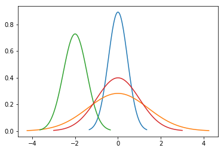
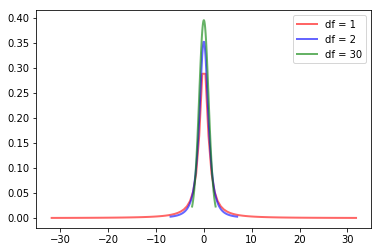

# 기본통계
## 목차 
1. [대표값](#대표값)
1. [산포도](#산포도)
1. [정규분포](#정규분포)
1. [중심극한정리](#중심극한정리)
1. [스튜던트t분포](#스튜던트t분포)
1. [정규성검정](#정규성검정)

## 대표값
자료 전체의 특징이나 경향을 하나의 수로 나타낸 값
* 평균(mean)  
  산술평균, 전체 데이터 합을 개수로 나눈값


```python
from statistics import *
mean([1,2,3,4,5])
```


    3


* 중앙값(median)  
numeric 데이터의 중간 값, 데이터 포인트의 개수가 홀수일 경우에는 중앙의 값이며 짝수일 경우에는 두 중앙 값의 평균으로 계산한다. 만약 데이터가 ordinal이면 median_low(), median_high()를 써야한다. 


```python
median([1,3,5])
```


    3


```python
median([1,3,5,7])
```


    4.0


* 최빈값(mode)  
  discrete 데이터에서 가장 common 값


```python
mode([1,1,2,3,3,3,4])
```


    3


#### Numpy 사용 예제


```python
import numpy as np
from scipy import stats
a = np.array([[1,3,4,2,2,7],
             [5,2,2,1,4,1],
             [3,3,2,2,1,1]])
m = np.mean(a)
print("mean : {}".format(m))
m = np.mean(a, axis=0)
print("mean axis=0 : {}".format(m))
m = np.mean(a, axis=1)
print("mean axis=1 : {}".format(m))
m = np.median(a)
print("median : {}".format(m))
m = np.median(a, axis=0)
print("median axis=0 : {}".format(m))
m = np.median(a, axis=1)
print("median axis=1 : {}".format(m))
m = stats.mode(a)
print("mode : {}".format(m))

```

    mean : 2.5555555555555554
    mean axis=0 : [3.         2.66666667 2.66666667 1.66666667 2.33333333 3.        ]
    mean axis=1 : [3.16666667 2.5        2.        ]
    median : 2.0
    median axis=0 : [3. 3. 2. 2. 2. 1.]
    median axis=1 : [2.5 2.  2. ]
    mode : ModeResult(mode=array([[1, 3, 2, 2, 1, 1]]), count=array([[1, 2, 2, 2, 1, 2]]))


## 산포도
자료의 흩어진 정도
1. 분산: 개별 관측치와 평균의 차이의 제곱의 평균
2. 표준편차: 분산에 제곱근을 구하여 원래 측정값들의 차수에 맞추어 준 것
3. 범위 : 가장 큰 값과 가장 작은 값 간의 차이. 특별히 큰 값이나 작은 값이 있으면 부적합
4. 사분위

## 정규분포
정규분포(Normal Distribution)는 하나의 꼭지를 가진 완벽한 좌우대칭으로 양꼬리 부분에는 자료가 거의 존재하지 않으며, 모든 정규분포는 평균(mu)와 표준편차(variance)에 의해 결정된다. 즉 정규분포를 띠는 자료라면 내용이 어떻든지 간에 평균과 표준편차만 같다면 모두 동일한 정규분포(N(mu, sigma))가 됨. 평균이 0이고 표준편차가 1인 정규분포를 **표준정규분포(Standard normal distribution)**, 혹은 z-분포라고 한다. 어떤 집단이 정규분포를 따른다고 가정하고 그 평균을 비교하는 것이 **z-검정** 이다.


```python
import matplotlib.pyplot as plt
import numpy as np
import scipy.stats as stats
import math

def plot_normal_distribution(mu=0, variance=1):
    sigma = math.sqrt(variance)
    x = np.linspace(mu - 3*sigma, mu + 3*sigma, 100)
    plt.plot(x, stats.norm.pdf(x, mu, sigma))
plot_normal_distribution(0, 0.2)
plot_normal_distribution(0, 2)
plot_normal_distribution(-2, 0.3)
# standard normal distribution
plot_normal_distribution()
plt.show()
```


    

    


## 중심극한정리
통계모형들은 자료가 정규분포라는 가정에 기초하여 발달됨. 모집단으로부터 무작위로 표본을 추출할 때 표본의 크기가 충분히 크다면 표본 변수들의 그 합 또는 평균의 히스토그램은 정규분포 곡선에 수렴하여 이를 중심극한정리(Central limit theorem) 이라고 한다. 모집단의 구성에 관계없이 항상 성립하며 히스토그램을 정규분포 곡선으로 가깝게 하는데 필요한 최소한의 추출 횟수는 모집단의 분포에 따라 달라진다.

모집단의 분포를 알지 못하는 경우에도 표본수가 충분히 크다면 중심극한정리에 의해 표본평균의 분포는 정규성을 띤다고 가정할 수 있으며, 이러한 정규성 가정을 통해 군간의 크기를 비교하기 쉬워짐


```python
import numpy as np
import matplotlib.pyplot as plt
import matplotlib.animation as animation
%matplotlib notebook
# 1000 simulations of die roll
n = 1000

# In each simulation, there is one trial more than the previous simulation
avg = []
for i in range(2, n):
    a = np.random.randint(1,7,i)
    avg.append(np.average(a))
    
# Function that will plot the histogram, where currnt is the latest figure
def clt(current):
    # if animation is at the last frame, stop it
    plt.cla()
    if current == 1000:
        a.event_source.stop()
    
    plt.hist(avg[0:current])
    
    plt.gca().set_title('Expected value of die rolls')
    plt.gca().set_xlabel('Average from die roll')
    plt.gca().set_ylabel('Frequency')
    
    plt.annotate('Die roll = {}'.format(current), [3, 27])

fig = plt.figure("Central limit theorem")
a = animation.FuncAnimation(fig, clt, interval=1)
```


    <IPython.core.display.Javascript object>


<img src="data:image/png;base64,iVBORw0KGgoAAAANSUhEUgAAAoAAAAHgCAYAAAA10dzkAAAgAElEQVR4Xu2dB5hURdaGD0GCkhGQnARUUMCAgIsrIiImEJXkrsASFDAACiiuLKwEFRAViSJZhVWRoKRVFzBhAEVExIDkKGFEJUj4n1O7Pf/k6aGmu+t2vfU8POL0rXvrvOfrqY9KN8fp06dPCwUCEIAABCAAAQhAwBsCOTCA3uSaQCEAAQhAAAIQgIAhgAFECBCAAAQgAAEIQMAzAhhAzxJOuBCAAAQgAAEIQAADiAYgAAEIQAACEICAZwQwgJ4lnHAhAAEIQAACEIAABhANQAACEIAABCAAAc8IYAA9SzjhQgACEIAABCAAAQwgGoAABCAAAQhAAAKeEcAAepZwwoUABCAAAQhAAAIYQDQAAQhAAAIQgAAEPCOAAfQs4YQLAQhAAAIQgAAEMIBoAAIQgAAEIAABCHhGAAPoWcIJFwIQgAAEIAABCGAA0QAEIAABCEAAAhDwjAAG0LOEEy4EIAABCEAAAhDAAKIBCEAAAhCAAAQg4BkBDKBnCSdcCEAAAhCAAAQggAFEAxCAAAQgAAEIQMAzAhhAzxJOuBCAAAQgAAEIQAADiAYgAAEIQAACEICAZwQwgJ4lnHAhAAEIQAACEIAABhANQAACEIAABCAAAc8IYAA9SzjhQgACEIAABCAAAQwgGoAABCAAAQhAAAKeEcAAepZwwoUABCAAAQhAAAIYQDQAAQhAAAIQgAAEPCOAAfQs4YQLAQhAAAIQgAAEMIBoAAIQgAAEIAABCHhGAAPoWcIJFwIQgAAEIAABCGAA0QAEIAABCEAAAhDwjAAG0LOEEy4EIAABCEAAAhDAAKIBCEAAAhCAAAQg4BkBDKBnCSdcCEAAAhCAAAQggAFEAxCAAAQgAAEIQMAzAhhAzxJOuBCAAAQgAAEIQAADiAYgAAEIQAACEICAZwQwgJ4lnHBjQ2DatGnSqVOndB/+n//8R6655prYNC4LT/3999/l6aefNm3N7vYuX75cGjduLNFmEavnZgG7uXTOnDnyz3/+UzZt2iRHjx6VL774QurUqRP2bUIa/Omnn6RSpUqmXiiHysCVMmjQIBk8eLCcPn06sUkuttMVXrQDAmdKAAN4puSoB4EsEAh1vlOnTpULLrggVc2LLrpIChUqlIU7xubSn3/+WUqUKCH/+Mc/RDvq7CyxMmKxem5W2O3bt0/Kli0rN9xwgzz00EOSN29eueSSS+Tss88O+zZpGcBvvvnG1Ff9uVIwgK5kgnbEOwEMYLxnmPicIBDqfD/77DO5/PLLnWjTmTQCA3gm1OzrfPjhh/KnP/3JjAK2bt36jG6YlgE8oxtlsZKOGmfFqGIAswiYyyFwhgQwgGcIjmoQyAqBcA3g7NmzpV27djJmzBi57777Eh+hI25DhgyRJUuWSNOmTWXz5s1SuXJleeqpp+SPP/6QiRMnyt69e6VWrVrmZ02aNEnWvO+//96M2r3zzjuSkJAgVapUMffv2bNnsusOHTokTzzxhLz55puyY8cOKVy4sDGszzzzjOTLl888M2Xp0KGDaHxawn3Ot99+K7169ZKVK1cac3DHHXfITTfdJLfeemuGU8Dz5s2T2267zcSRMsbx48dLjx49ZO3atWZ07PPPP5eRI0fKqlWrZM+ePVKqVClp0KCBPPnkk1KxYsXEMNIaAUxvyrFjx46i1yv/UDl+/LiZFp81a5bo9KqO5N58883mZzpamllZsGCBDB8+3LQ7V65cUr9+fTPVq23Vos+cPn16stv8+c9/Nu1Ir2jMOlK4evVqKVasmGiONOfdunUzbcxoCtgmHm3r66+/Lh9//LF5vv5XNan/1TJlyhR57rnnZOPGjSbvGsewYcPkwgsvTAwlXAOo+Z4wYYL8+OOPkiNHDjNC2qpVK3M/CgQgkDkBDGDmjLgCAtYEQgZQO+bLLrss2f2089KOP1S6d+9uOkod9VHz9d577xnTN2DAAGPOtIQMYPny5Y2Z6d27t5w6dcqYji+//FJWrFiRaCB0mq9hw4ZSoUIF6du3r5x33nmydOlSGT16tAwcONAYQy2HDx82dfTe/fv3lyuvvFJ+/fVXY9JatGhh7qGmQ6chO3fuLF26dDH11ORUrVpVwn2OmjE1aGeddZYxtWrMXn75ZXn//fdl69atGRrAEydOmI5eeajhSlq0vfq5mh4takTWrVsndevWNSZo165doqZB26l/zj33XHOdjQFU5mpcte39+vUzjLZs2WKYqnlWE5o/f/509fPKK6/IXXfdJddff70xr8eOHTM51Ha/++67ZtRPDY7mS826mhtdJ6kmM71pW43tiiuuMCbv8ccfN0Zr3LhxsmHDBsM3IwNoG48aQI1Jc3TPPfdIvXr1TE40PjW5qmH9B85f/vIX2b9/v1lGoP/VkfFq1aoZTuEYwNA/lO6//3655ZZbJGfOnPLDDz+YvKrBpEAAApkTwABmzogrIGBNIKNNIGr+tJMMFTUBasR0NO7tt982Hb6uG1RDEDKKIQNYpkwZYxB0dC5k4rTjv/TSS+Xf//63+ZkatvXr15s/SdcZauc5efJk2blzpxQtWtSYSzWEWu+6665LM+aMpoDDfc4jjzxiTI5uYqhdu3bic9Qk6LMz2wSiI0tq5NTQqcnSouZGDVHKkdOkQZw8edJsnlDDqUbqgQcesDaAISPyxhtvmNGnUFHjpyZMjZca+rSKmi018MWLFzemXU2MFjXdaqjPP/9884+ApCb1tddeM6OlGZW2bduKjiqq0dNYtWjsOhKnI68ZGUCbePQ5odFK/QdM0k1PqmXVqmpZNR0q27ZtM8bv9ttvN/8I0BKOAVTt6j8ADh48aP3d5AYQ8JUABtDXzBN3VAmEDOCMGTOSTXdpI3QEMOWooI5m6M90Ok5NmxqE0qVLJ7Y5ZAB1GldNT9KinfCrr74quvZKp4cLFixoTIhO4yYtarZuvPFGWbRokTRv3tyMXulojE7PpVfSM4BqrMJ9jo7Uadt0lCtpCTHKzACqkVUzo9PeOqWpRUffnn/+eWNmdbQvZKTU1Ko5U15qgkLl3nvvNSZSi80IoI5kqaHR6XfNY9Ki5u7qq6826/bSKiHTqmZYR2aTFh0N1Ph0VFZH8EJtDMcAqunTkbeFCxcmu2fIWGVkAG3i0YeFDKAuM0j6j43Fixcbrf3rX/+SO++8M1m79Odr1qyR3bt3m5+HYwBnzpwpd999t6jZ1T9XXXVV4ohuVL/YPAwCASaAAQxw8mh6cAiEuwYwaUS6jkzNhU7vpjRvIQOoU6iPPfZYMhA6wqbrAHXURUeTypUrlyEoNaV//etfzUiMThPrSGN6JT0DqOsFw32OjmzpWsLQCGXoWbq+UY1oZgZQr1eDo6OhurZMjZ2arUaNGiUzW7qeUGPRaVAdjVNDoiZNDYf+Ca1btDGAOhWt6xHTK9dee226PD/44APTZjUzarySFs2rtnv79u1mOjUrBjB37txm9O3FF19Mdk9dL6f/EMjIANrEEzKAalJ/++23ZM/W0TrVmE6V67R20qJLCXSNo/5jJVwDqNfpjnqN8dNPPzXLHzTHyk1joEAAApkTwABmzogrIGBNIKsGUKdmu3btaoyOTpVqx6kjZ6ES7gigTier8dHON+WGj9C91IzpNKTNCKCO6IX7HNsRQG13aMOHrvnSc/HULOsok05Da9ERKJ3W1rV4oTWO+nPlcc455xjDlZEB1PvoPUKbF0Ks9Dlff/114iYQXc+mRlbNa1pFR0Vr1KiR5mcujgDaxBMygLr2Uv/hkbRkNgKoGtcp/awYwND91WzqOlXNs26k+e6775Jt8rH+8nIDCMQpAQxgnCaWsNwikBUDqFOjapJ0qkxHONSY6cibdpJqarRktgZQNz6ERqZ0RETPkdORkjx58qQLJrQGUEfNdOQqraJTkmr0dMpVRxmTlnCfY7sGUJ+po5s6Ja7r+NQAqlHTDQ6hdXS//PKLWR+oGw/0eaEyduxYs/s56c7ltEYAdYpYR7J0SlnP3NOi0+M6Sqrxh3YB67o1NZO6uSepQQ9HfTpqpSOuuolGp0BDU8hqaHTHrj5LRwm1ZGUE0GYNoE08GRnA0BpA1cj8+fMT8egIp44I67rG0KaecKaA0+Kr923ZsqUZNdcRXgoEIJAxAQwgCoFAFAhkdhC0LvpXI6Cdv+78VSOjhk1Hq9Tg6KYOPZpEj0FJagBDu4D79OljpsHUlKlRVMOg66K06CiZTrupodApQN0kokZO1xnqOjHdZawltAtYd7GqadLRxyNHjpgdxTrypQv4tWh93XSia+50vZ3uptWfhfscXeulu4DVjCbdBayjOLopIJwpYG1H+/btzfSqmouHH35Yhg4dmiyTesSIjtYpE22fxvHSSy+ZmHRXc0YjgKFz99SY6Eismj9dqxfadBAygDr9rLtQP/nkE3nwwQcNM93drMZG49Dn6LE16ZXQLmA1LLprVkcoR4wYYUayQruAs2oANWZth47s6qYeXUOoxlfzo3wzmgK2jSd0DEzKEUCNIbQLWEejdaRRmeobP/QfJ1ndBaw50d3VqnH9h4BqSu+vselRROEcvxOFrz2PgIDTBDCATqeHxsULgcxeBacjfboWSjvHuXPnmg4x6TEfOq2mI4J6dIuen5f0HEDdgKH1dSNCzZo1zTl3uqM2adHrdYRPjxPR64oUKWIMoRqPpGsI1UzpCIyeA6hTcjriqGurRo0alTiVqcZENy2ooVDDknQ0Ldzn6PSnGiad2laDoiZJ1+ypYQrXAOrUayhOnfYLHSMSilvXJeoz1ODqLms1C3ouoB7bomY6IwOo99C1kcpSTYWOyOkUo26YSXkOoN5bjx7RtXy6gUbX4Ol6SDWgakx1hCujoiNXaZ0DqCO/oZKVEUCt89FHH5lz+EKjxqE1nuGcA2gTT0YGUNulBlz/4aC7kdXAaR50R3ZSrYczAqi50fypBtWU6z9C9B85f//73+Xiiy+Ol18bxAGBiBLAAEYULzeHQGQIhAygjhapyaBAAAIQgAAEskIAA5gVWlwLAUcIYAAdSQTNgAAEIBBQAhjAgCaOZvtNAAPod/6JHgIQgIAtAQygLUHqQwACEIAABCAAgYARwAAGLGE0FwIQgAAEIAABCNgSwADaEqQ+BCAAAQhAAAIQCBgBDGDAEkZzIQABCEAAAhCAgC0BDKAtQepDAAIQgAAEIACBgBEIpAHUg0r1sFB9bZGeAK8nwesBpHoIaOhVUKdPnzanzE+aNMkcFKqvadLT8PWg3FDRn+urpBYsWGB+pAfRjhkzxhySG07RNy/oq6L0fZ+h1ziFU49rIAABCEAAAhCIHQH1CPr2ozJlyiT6hti1JjZPDqQB1Fc+6RsRpk+fbgzd559/Lp06dTKvldKT/7Xo65/0Oj0tvnr16uYzfdWUntSvhk1L8+bNzSub1CRq0VPy9ZVR+nqscIrW1VdxUSAAAQhAAAIQCB4BfT2ivrnHxxJIA6jvJS1VqpR5rVCo3H777eaVUvo6JnX26ur1lVn9+/c3l+grq7SOGkN956a+ikpfP5T0Je769wYNGpjXFNWoUSNTPSQkJJjRQhWQviCeAgEIQAACEICA+wR++eUXM4Cjr78sXLiw+w2OQAsDaQD1/ZwTJkyQZcuWmdE9fXG6vhP02WefNS8Z37Rpk1StWlXWrFkjdevWTcSm7xlVw6Yjh1OmTJE+ffqY5Cct+rmOLuqIYsqiJlL/hEpIQGoEMYARUCe3hAAEIAABCESAgPbfavx87r8DaQB1hG/AgAFmNC9Xrlxy8uRJM9376KOPGpnoi9D1xe/6MngdCQwVneLdsmWLLF261LyAXKeH9SXySYsaSjV/oXsl/Sz0kvKUWvRZQBH4XnJLCEAAAhCAQEQJYABFAmkAZ8+eLX379pURI0aYNYBffvmlme595plnpEOHDokGUDdo6AaRUOnatauZrl2yZIkxgDoSqGsCk5Zq1apJ586d5ZFHHmEEMKJfP24OAQhAAAIQiA0BDGBADaDO26tB69mzZ6JydJPHrFmzzPq9SE0Bp5QpAorNF5enQgACEIAABGwI0H8H1AAWL17c7Ort3r17Yv6HDx8uU6dONVO6oU0gvXv3ln79+plrjh8/LiVLlky1CeSTTz6RevXqmWv07/Xr1w97EwgCsvn6URcCEIAABCAQGwL03wE1gHrm3zvvvCMTJ040U8BffPGFOcLlb3/7mzF4WvS/IVOo07o65bt8+fJUx8DoNLHeR4veo2LFimEfA4OAYvPF5akQgAAEIAABGwL03wE1gHp44+OPPy5vvvmm7N2712z00N2/AwcOlDx58hhNhA6CVnOX9CDoWrVqJWrmwIEDqQ6CfuGFF8I+CBoB2Xz9qAsBCEAAAhCIDQH674AawNjIJfVTEZArmaAdEIAABCAAgfAJ0H9jAMNXSxpXIiArfFSGAAQgAAEIxIQA/TcG0Ep4CMgKH5UhAAEIQAACMSFA/40BtBIeArLCR2UIQAACEIBATAjQf2MArYSHgKzwURkCEIAABCAQEwL03xhAK+EhICt8VIYABCAAAQjEhAD9NwbQSngIyAoflSEAAQhAAAIxIUD/jQG0Eh4CssJHZQhAAAIQgEBMCNB/YwCthIeArPBR2TMClR55O3ARb37ypsC1mQZDAAKZE6D/xgBmrpIMrkBAVvio7BkBDKBnCSdcCDhMgP4bA2glTwRkhY/KnhHAAHqWcMKFgMME6L8xgFbyREBW+KjsGQEMoGcJJ1wIOEyA/hsDaCVPBGSFj8qeEcAAepZwwoWAwwTovzGAVvJEQFb4qOwZAQygZwknXAg4TID+GwNoJU8EZIWPyp4RwAB6lnDChYDDBOi/MYBW8kRAVvio7BkBDKBnCSdcCDhMgP4bA2glTwRkhY/KnhHAAHqWcMKFgMME6L8xgFbyREBW+KjsGQEMoGcJJ1wIOEyA/hsDaCVPBGSFj8qeEcAAepZwwoWAwwTovzGAVvJEQFb4qOwZAQygZwknXAg4TID+GwNoJU8EZIWPyp4RwAB6lnDChYDDBOi/MYBW8kRAVvio7BkBDKBnCSdcCDhMgP4bA2glTwRkhY/KnhHAAHqWcMKFgMME6L8xgFbyREBW+KjsGQEMoGcJJ1wIOEyA/hsDaCVPBGSFj8qeEcAAepZwwoWAwwTovzGAVvJEQFb4qOwZAQygZwknXAg4TID+GwNoJU8EZIWPyp4RwAB6lnDChYDDBOi/MYBW8kRAVvio7BkBDKBnCSdcCDhMgP4bA2glTwRkhY/KnhHAAHqWcMKFgMME6L8xgFbyREBW+KjsGQEMoGcJJ1wIOEyA/hsDaCVPBGSFj8qeEcAAepZwwoWAwwTovzGAVvJEQFb4qOwZAQygZwknXAg4TID+GwNoJU8EZIWPyp4RwAB6lnDChYDDBOi/MYBW8kRAVvio7BkBDKBnCSdcCDhMgP4bA2glTwRkhY/KnhHAAHqWcMKFgMME6L8xgFbyREBW+KjsGQEMoGcJJ1wIOEyA/jugBrBSpUqyZcuWVNLq0aOHjB07Vo4dOyYPP/ywvPrqq3LkyBFp0qSJjBs3TsqVK5dYZ+vWrdKzZ0957733JH/+/NK+fXsZOXKk5MmTJ2zJIqCwUXEhBAQDiAggAAFXCNB/B9QA7tu3T06ePJmoo6+//lqaNm0q//nPf+Saa66R7t27y8KFC2XatGlSvHhxeeihh+TAgQOyevVqyZUrl6lbp04dKVGihIwaNUr2798vHTp0kFatWsmYMWPC1icCChsVF0IAA4gGIAABZwjQfwfUAKZUUK9eveStt96S77//XjSpauxmzpwpbdq0MZfu3LlTypcvL4sWLZJmzZrJ4sWL5eabb5Zt27ZJmTJlzDWzZ8+Wjh07yt69e6VQoUJhiRQBhYWJiyBgCDACiBAgAAFXCNB/x4EBPH78uDFxffr0kQEDBpgpXZ3y1RG/okWLJmqtdu3a0rJlSxk8eLAMHDhQ5s+fL2vXrk38/ODBg1KsWDFTv3HjxmlqVKeW9U+oqIDUWCYkJIRtGl0RP+2AQLQJYACjTZznQQAC6RHAAMaBAfzXv/5l1u/pmj41gq+88op06tQpmVFTAVx//fVSuXJlmThxonTr1k02b94sy5YtS6aNvHnzmmnjdu3apamZQYMGGQOZsmAA+SUDgcwJYAAzZ8QVEIBAdAhgAOPAAOqUrm7c0DV/WtIzgLpGsGrVqjJhwgRjAHUTydKlS5MpTe8zY8YMadu2LSOA0fkO8hSPCGAAPUo2oULAcQIYwIAbQDVxVapUkblz50qLFi2M3CI5BZxSzwjI8W84zXOKAAbQqXTQGAh4TYD+O+AGUKdkdUpXN3Pkzp3biFmnY3UTyKxZs6R169bmZ7t27TJHwKTcBLJ9+3YpXbq0uWbOnDlmJzCbQLz+nUDwESSAAYwgXG4NAQhkiQAGMMAG8NSpU2ZNn67Xe/LJJ5MlXo+B0V3Bup5PN3bomYB61EvKY2BKlSolI0aMMBtGdAewbhLhGJgsfYe4GAJhE8AAho2KCyEAgQgTwAAG2ADqBg5d/7dx40apXr16MqkcPXpU+vbta9YDJj0IWnfshopuGtGDo1MeBK0bQcItCChcUlwHAY6BQQMQgIA7BOi/A2wAXZARAnIhC7QhKAQYAQxKpmgnBOKfAP03BtBK5QjICh+VPSOAAfQs4YQLAYcJ0H9jAK3kiYCs8FHZMwIYQM8STrgQcJgA/TcG0EqeCMgKH5U9I4AB9CzhhAsBhwnQf2MAreSJgKzwUdkzAhhAzxJOuBBwmAD9NwbQSp4IyAoflT0jgAH0LOGECwGHCdB/YwCt5ImArPBR2TMCGEDPEk64EHCYAP03BtBKngjICh+VPSOAAfQs4YQLAYcJ0H9jAK3kiYCs8FHZMwIYQM8STrgQcJgA/TcG0EqeCMgKH5U9I4AB9CzhhAsBhwnQf2MAreSJgKzwUdkzAhhAzxJOuBBwmAD9NwbQSp4IyAoflT0jgAH0LOGECwGHCdB/YwCt5ImArPBR2TMCGEDPEk64EHCYAP03BtBKngjICh+VPSOAAfQs4YQLAYcJ0H9jAK3kiYCs8FHZMwIYQM8STrgQcJgA/TcG0EqeCMgKH5U9I4AB9CzhhAsBhwnQf2MAreSJgKzwUdkzAhhAzxJOuBBwmAD9NwbQSp4IyAoflT0jgAH0LOGECwGHCdB/YwCt5ImArPBR2TMCGEDPEk64EHCYAP03BtBKngjICh+VPSOAAfQs4YQLAYcJ0H9jAK3kiYCs8FHZMwIYQM8STrgQcJgA/TcG0EqeCMgKH5U9I4AB9CzhhAsBhwnQf2MAreSJgKzwUdkzAhhAzxJOuBBwmAD9NwbQSp4IyAoflT0jgAH0LOGECwGHCdB/YwCt5ImArPBR2TMCGEDPEk64EHCYAP03BtBKngjICh+VPSOAAfQs4YQLAYcJ0H9jAK3kiYCs8FHZMwIYQM8STrgQcJgA/TcG0EqeCMgKH5U9I4AB9CzhhAsBhwnQf2MAreSJgKzwUdkzAhhAzxJOuBBwmAD9NwbQSp4IyAoflT0jgAH0LOGECwGHCdB/YwCt5ImArPBR2TMCGEDPEk64EHCYAP03BtBKngjICh+VPSOAAfQs4YQLAYcJ0H9jAK3kiYCs8FHZMwIYQM8STrgQcJgA/TcG0EqeCMgKH5U9I4AB9CzhhAsBhwnQf2MAreSJgKzwUdkzAhhAzxJOuBBwmAD9d4AN4I4dO6R///6yePFiOXLkiFSvXl1eeuklueyyy4zkTp8+LYMHD5ZJkybJwYMH5corr5SxY8dKzZo1EyWpP3/ggQdkwYIF5me33nqrjBkzRooUKRKWbBFQWJi4CAKGAAYQIUAAAq4QoP8OqAFU41a3bl1p3LixdO/eXUqWLCk//vijVKpUSapWrWr09dRTT8nQoUNl2rRpxhwOGTJEVq5cKRs3bpSCBQuaa5o3by7bt283JlFLt27dzD0WLlwYlkYRUFiYuAgCGEA0AAEIOEWA/jugBvCRRx6RDz/8UN5///00BaWjf2XKlJFevXqZUUItx44dk1KlShljeM8998iGDRvkoosuklWrVpnRQS369wYNGsi3334rNWrUyFSsCChTRFwAgUQCjAAiBghAwBUC9N8BNYBq3Jo1a2ZG71asWCFly5aVHj16SNeuXY22Nm3aZEYC16xZY0YKQ6VFixZmenf69OkyZcoU6dOnjxw6dCiZHvXz0aNHS6dOnTLVKQLKFBEXQAADiAYgAAHnCNB/B9QA5suXz4hJDdydd94pn376qRntmzhxotx9993y0UcfyVVXXSW6TlBHAkNFp3i3bNkiS5culWHDhpnp4e+++y6ZMHW6WM3fo48+mkqwOoqof0JFBVS+fHlJSEiQQoUKOSdwGgQBlwgwAuhSNmgLBPwmgAEMqAHMkyePXH755cbohYpu5vjss8/k448/TjSAO3fulNKlSydeoyOE27ZtkyVLlhgDqCOBuiYwaalWrZp07txZdJo5ZRk0aJDZWJKyYAD9/kVC9OERwACGx4mrIACByBPAAAbUAFasWFGaNm0qkydPTlTJ+PHjzUYPHfWL1BQwI4CR/1LyhPglgAGM39wSGQSCRgADGFAD2L59ezOSl3QTSO/eveWTTz4xo3+hTSD6s379+hldHj9+3OwWTrkJROvUq1fPXKN/r1+/PptAgvZNpr2BIIABDESaaCQEvCCAAQyoAdSp3oYNG5rp2NatW5s1gDq9q8e53HXXXUa8avSGDx8uU6dOFZ3W1Snf5cuXpzoGRqeJde2gFl0jqKOLHAPjxfefIKNMAAMYZeA8DgIQSJcABjCgBlAz+tZbb5mNGt9//71UrlzZbAgJ7QLWz0MHQau5S3oQdK1atRIFceDAgVQHQb/wwgscBM0vDQhEgAAGMAJQuSUEIHBGBDCAATaAZ5TxbK6EgLIZKLeLawIYwLhOL8E6XQQAACAASURBVMFBIFAE6L8xgFaCRUBW+KjsGQEMoGcJJ1wIOEyA/hsDaCVPBGSFj8qeEcAAepZwwoWAwwTovzGAVvJEQFb4qOwZAQygZwknXAg4TID+GwNoJU8EZIWPyp4RwAB6lnDChYDDBOi/MYBW8kRAVvio7BkBDKBnCSdcCDhMgP4bA2glTwRkhY/KnhHAAHqWcMKFgMME6L8xgFbyREBW+KjsGQEMoGcJJ1wIOEyA/hsDaCVPBGSFj8qeEcAAepZwwoWAwwTovzGAVvJEQFb4qOwZAQygZwknXAg4TID+GwNoJU8EZIWPyp4RwAB6lnDChYDDBOi/MYBW8kRAVvio7BkBDKBnCSdcCDhMgP4bA2glTwRkhY/KnhHAAHqWcMKFgMME6L8xgFbyREBW+KjsGQEMoGcJJ1wIOEyA/hsDaCVPBGSFj8qeEcAAepZwwoWAwwTovzGAVvJEQFb4qOwZAQygZwknXAg4TID+GwNoJU8EZIWPyp4RwAB6lnDChYDDBOi/MYBW8kRAVvio7BkBDKBnCSdcCDhMgP4bA2glTwRkhY/KnhHAAHqWcMKFgMME6L8xgFbyREBW+KjsGQEMoGcJJ1wIOEyA/hsDaCVPBGSFj8qeEcAAepZwwoWAwwTovzGAVvJEQFb4qOwZAQygZwknXAg4TID+GwNoJU8EZIWPyp4RwAB6lnDChYDDBOi/MYBW8kRAVvio7BkBDKBnCSdcCDhMgP4bA2glTwRkhY/KnhHAAHqWcMKFgMME6L8xgFbyREBW+KjsGQEMoGcJJ1wIOEyA/hsDaCVPBGSFj8qeEcAAepZwwoWAwwTovzGAVvJEQFb4qOwZAQygZwknXAg4TID+GwNoJU8EZIWPyp4RwAB6lnDChYDDBOi/MYBW8kRAVvio7BkBDKBnCSdcCDhMgP4bA2glTwRkhY/KnhHAAHqWcMKFgMME6L8xgFbyREBW+KjsGQEMoGcJJ1wIOEyA/hsDaCVPBGSFj8qeEcAAepZwwoWAwwTovzGAVvJEQFb4qOwZAQygZwknXAg4TID+GwNoJU8EZIWPyp4RwAB6lnDChYDDBOi/MYBW8kRAVvio7BkBDKBnCSdcCDhMgP47oAZw0KBBMnjw4GTSKlWqlOzevdv87PTp0+bzSZMmycGDB+XKK6+UsWPHSs2aNRPr6M8feOABWbBggfnZrbfeKmPGjJEiRYqELVkEFDYqLoSAYAARAQQg4AoB+u8AG8DXX39d3nnnnUQt5cqVS0qUKGH+/6mnnpKhQ4fKtGnTpHr16jJkyBBZuXKlbNy4UQoWLGiuad68uWzfvt2YRC3dunWTSpUqycKFC8PWJwIKGxUXQgADiAYgAAFnCNB/B9gAzps3T7788stUYtLRvzJlykivXr2kf//+5vNjx46JjhCqMbznnntkw4YNctFFF8mqVavM6KAW/XuDBg3k22+/lRo1aoQlUgQUFiYugoAhwAggQoAABFwhQP8dYAM4YsQIKVy4sOTNm9eYuGHDhkmVKlVk06ZNUrVqVVmzZo3UrVs3UWstWrQw07vTp0+XKVOmSJ8+feTQoUPJtKifjx49Wjp16hSWRhFQWJi4CAIYQDQAAQg4RYD+O6AGcPHixfL777+b6d09e/aYKV4duVu/fr2Z5r3qqqtkx44dZiQwVHSKd8uWLbJ06VJjFnV6+LvvvksmSL2fmr9HH300TaHqSKL+CRUVUPny5SUhIUEKFSrklLhpDARcI8AIoGsZoT0Q8JcABjCgBjClZH/77Tcz6tevXz+pX7++MYA7d+6U0qVLJ17atWtX2bZtmyxZssQYQB0JVLOYtFSrVk06d+4sjzzySJrfirQ2n+iFGEB/f4kQefgEMIDhs+JKCEAgsgQwgHFiAFUmTZs2lfPPP1/69u0bsSlgRgAj+4Xk7vFNAAMY3/klOggEiQAGME4MoBozHQHUad7HH3/cTP327t3bjAhqOX78uJQsWTLVJpBPPvlE6tWrZ67Rv+voIZtAgvQVpq1BIoABDFK2aCsE4psABjCgBvDhhx+WW265RSpUqCB79+41awBXrFgh69atk4oVKxqjN3z4cJk6darotK5O+S5fvjzVMTA6TTxx4kSjcjWPWpdjYOL7S090sSOAAYwde54MAQgkJ4ABDKgBbNu2rTnX7+effzZn/+nI3RNPPGGOdtESOghazV3Sg6Br1aqVqIADBw6kOgj6hRde4CBofktAIEIEMIARAsttIQCBLBPAAAbUAGY50xGqgIAiBJbbxiUBDGBcppWgIBBIAvTfGEAr4SIgK3xU9owABtCzhBMuBBwmQP+NAbSSJwKywkdlzwhgAD1LOOFCwGEC9N8YQCt5IiArfFT2jAAG0LOEEy4EHCZA/40BtJInArLCR2XPCGAAPUs44ULAYQL03zEwgLNmzZI77rhD8uXL57A0wmsaAgqPE1dBQAlgANEBBCDgCgH67xgYQD2QWQ9mbtOmjXntWuggZldEkZV2IKCs0OJa3wlgAH1XAPFDwB0C9N8xMIAnTpyQBQsWyLRp08x7efWg5r/97W9y9913mzP9glQQUJCyRVtjTQADGOsM8HwIQCBEgP47BgYwqfx2794tM2bMkOnTp8sPP/wgN910kxkVvPHGGyVHjhzOKxUBOZ8iGugQAQygQ8mgKRDwnAD9d4wNoOpv9erVMmXKFHnppZfM+3oTEhLMSKC+xq1Ro0ZOSxQBOZ0eGucYAQygYwmhORDwmAD9d4wMoL7CTTeDqMnbuHGjea+vjvw1a9ZMfvvtN/n73/8u8+fPl59++slpeSIgp9ND4xwjgAF0LCE0BwIeE6D/joEBvO2222TRokVSuXJl6dKli3To0CHV2r+dO3dKuXLl5NSpU07LEwE5nR4a5xgBDKBjCaE5EPCYAP13DAygGj41fhlN754+fVo2bdokVatWdVqeCMjp9NA4xwhgAB1LCM2BgMcE6L9jYADjSW8IKJ6ySSyRJoABjDRh7g8BCIRLgP47Bgawd+/eZmTvvvvuS5ansWPHmlG/UaNGhZu/mF+HgGKeAhoQIAIYwAAli6ZCIM4J0H/HwADq2r558+bJ5Zdfnkxea9askVtvvVW2b98eGNkhoMCkioY6QAAD6EASaAIEIGAI0H/HwADqK+DWr1+fan2fngNYq1YtOXr0aGDkiYACkyoa6gABDKADSaAJEIAABvB/GshxWndcRLHUrFlTevbsKT169Ej2VJ0CfuGFF2TDhg1RbI3dozCAdvyo7RcBDKBf+SZaCLhMgP47BiOAL774ovTq1UseeeQRufbaa40+3n33XXn66adl5MiRcu+997qsmWRtQ0CBSRUNdYAABtCBJNAECECAEcBYjQDqc8eMGSPDhg2TPXv2mGbousBBgwaZdwIHqWAAg5Qt2hprAhjAWGeA50MAAiEC9N8xGAFMKr9du3ZJ/vz5pUiRIoFUJQIKZNpodIwIYABjBJ7HQgACqQjQf8fYAAZdkwgo6Bmk/dEkgAGMJm2eBQEIZESA/jsGBnDfvn3Sr18/s+5v7969qV73dvz48cCoFgEFJlU01AECGEAHkkATIAABQ4D+OwYG8KabbpIff/zR7AQuXbq05MiRI5kcb7/99sDIEwEFJlU01AECGEAHkkATIAABDOD/NBD1Y2AKFiwoK1eulLp16wZehhjAwKeQAKJIAAMYRdg8CgIQyJAA/XcMRgAvvPBCefXVV6VOnTqBlycCCnwKCSCKBDCAUYTNoyAAAQxgJhqI+gjgkiVL5LnnnhM9D1CPfwlywQAGOXu0PdoEMIDRJs7zIACB9AjQf8dgBLBEiRJy+PBh+eOPP6RQoUJy1llnJcuPbgwJSkFAQckU7XSBAAbQhSzQBghAQAnQf8fAAL700ksZqq9z586BUScCCkyqaKgDBDCADiSBJkAAAoYA/XcMDGA8aQ8BxVM2iSXSBDCAkSbM/SEAgXAJ0H/HyABu3rxZpk2bZo6DGTVqlJQsWVKWLVsm5cuXF90kEpSCgIKSKdrpAgEMoAtZoA0QgAAjgP/VQNQ3gbz//vtyww03SL169eSjjz6SDRs2SJUqVeTJJ5+U1atXy2uvvRYYdWIAA5MqGuoAAQygA0mgCRCAAFPA/9NA1A1gw4YN5bbbbpO+ffuKngm4du1aYwA//fRT0UOgt23bFhh5YgADkyoa6gABDKADSaAJEIAABjBWBrBAgQKybt06qVy5cjIDqNPCF1xwgRw9ejQw8sQABiZVNNQBAhhAB5JAEyAAAQxgrAygnv2n07wNGjRIZgDnzZsnDz30kFkXGJSCAQxKpminCwQwgC5kgTZAAAJKgP47BmsAH374Yfnss8/k9ddfl6pVq8qXX34p+/btk7vuusv8GTx4cGDUiYACkyoa6gABDKADSaAJEIAAI4CxGgE8fvy4/PWvf5U33nhDTp06JXny5DGHQrdu3VpmzpwpuXPnzrI8hw8fLgMGDJAHH3xQnn32WVP/2LFjomZTXzt35MgRadKkiYwbNy7Z20e2bt0qPXv2lPfee0/y588v7du3l5EjR5o2hVMwgOFQ4hoI/JcABhAlQAACrhCg/47BCGAo+d99952sWbPGmMBLL73UrP87k6KjiWoe9a0ijRs3TjSA3bt3l4ULF5rjZooXL26mlw8cOGB2GufKlUtOnjxp3kesbybRo2j2798vHTp0kFatWsmYMWPCagoCCgsTF0EAA4gGIAABpwjQf8fQAGaHEn799VdjHnVkb8iQIcbQ6QhgQkKCMXY6otimTRvzqJ07d5pzBhctWiTNmjWTxYsXy80332x2HZcpU8ZcM3v2bOnYsaPo6+jUUGZWEFBmhPgcAv9PgBFA1AABCLhCgP47BgawW7duGeZ/0qRJYetDR+yKFSsmo0ePlmuuuSbRAOqUrk756ohf0aJFE+9Xu3ZtadmypVlnOHDgQJk/f745hiZUDh48aO6n9XU0MWXRaWX9EyoqIDWVajjDMYxhB8aFEIhDAhjAOEwqIUEgoAQwgDEwgLfccksyuej6v/Xr18vhw4fl6quvlgULFoQlJx2tGzp0qNlQki9fvmQG8JVXXpFOnTolM2t60+uvv94cPzNx4kRRI6pHz+gbSJKWvHnzmmnjdu3apWrHoEGD0tykggEMK2Vc5DkBDKDnAiB8CDhEAAMYAwOYVv5PnDghumZPXwPXp0+fTCWi07aXX365MW86qqcl6QhgegawadOmZufxhAkTjAHcsmWLLF26NNnzdAPIjBkzpG3btowAZpoJLoBA+AQwgOGz4koIQCCyBDCAjhhATfPGjRuNidu1a1emWdczA/VtIrqZI1R0U0eOHDkkZ86cxtRdd9112T4FnLJhCCjTVHEBBBIJYAARAwQg4AoB+m+HDKBuytDjYX7++edM9aHTxTp6l7TolK/uJO7fv79Zl6ebQGbNmmV2CGtRY6mHUKfcBLJ9+3YpXbq0uWbOnDlmJzCbQDJNARdAIMsEMIBZRkYFCEAgQgQwgDEwgP369UuWztOnTxtzpmv/9CDo8ePHn1G6k04B6w10Svmtt94y6/l0Y4eeCahHvaQ8BqZUqVIyYsQIM1qoO4B1kwjHwJxRCqgEgQwJYAARCAQg4AoBDGAMDGCjRo2S5V+nbHW07tprr5WuXbvKWWeddUb6SGkA9Z3Cffv2FV0PmPQgaB0dDBU9CLpHjx6pDoLWjSDhFAQUDiWugcB/CWAAUQIEIOAKAfrvGBhAV5KfHe1AQNlBkXv4QgAD6EumiRMC7hOg/8YAWqkUAVnho7JnBDCAniWccCHgMAH67xgYwCuuuMLs1g2nfPrpp+FcFrNrEFDM0PPgABLAAAYwaTQZAnFKgP47BgZQN4HoQczVq1eXBg0aGGmtWrXKHANzzz33SNL1d0888YTT0kNATqeHxjlGAAPoWEJoDgQ8JkD/HQMDqAcwn3vuuTJs2LBk0nvsscdkz549Mnny5MBIEgEFJlU01AECGEAHkkATIAABQ4D+OwYGsEiRIub1bdWqVUsmw++//9683UNfqxaUgoCCkina6QIBDKALWaANEIAABvC/GshxWg/ii2LRc/eefvppc+By0jJ9+nRzbIsewhyUggEMSqZopwsEMIAuZIE2QAACGMAYGcChQ4fKkCFDzHq/+vXrm1boGsAXX3xRBgwYIDoVHJSCAQxKpminCwQwgC5kgTZAAAIYwBgZQH2sHs783HPPyYYNG0wrLrzwQnnwwQelffv2gVImBjBQ6aKxMSaAAYxxAng8BCCQSID+OwZTwPGkPwQUT9kklkgTwABGmjD3hwAEwiVA/x0jA6jg586dK5s2bZLevXtL0aJFZe3atVKyZEkpXbp0uPmL+XUIKOYpoAEBIoABDFCyaCoE4pwA/XcMDODXX38t1113nZx99tmybds2c/5flSpVzNq/7du3i24GCUpBQEHJFO10gQAG0IUs0AYIQEAJ0H/HwAA2bdpULr74Yhk1apQUKlTIjPypAfzoo4/krrvukp9++ikw6kRAgUkVDXWAAAbQgSTQBAhAwBCg/46BAdRzAD///HM5//zzpWDBgokGcMuWLVKjRg05evRoYOSJgAKTKhrqAAEMoANJoAkQgAAG8H8aiPo5gLrOb9myZVKnTp1kBvCdd96Rjh07mmngoBQMYFAyRTtdIIABdCELtAECEGAE8L8aiLoB7NKlixw8eFDmzJljNn989dVXkidPHmnRooU0bNhQnn/++cCoEwMYmFTRUAcIYAAdSAJNgAAEGAGM1QigvurthhtuEH3126FDh6R8+fKyc+dOueKKK2TJkiVSoECBwMgTAxiYVNFQBwhgAB1IAk2AAAQwgLEygPpcffvcv//9b1mzZo2cOnVKLr30UmnWrJnkyJEjUNLEAAYqXTQ2xgQwgDFOAI+HAAQSCdB/R3kK+I8//pAbb7xRxo0bJ9WqVQu8FBFQ4FNIAFEkgAGMImweBQEIZEiA/jvKBlCzce6555p3/+ou4KAXBBT0DNL+aBLAAEaTNs+CAAQyIkD/HQMD2KtXLznnnHNk6NChgVcnAgp8CgkgigQwgFGEzaMgAAFGADPRQNR3AasBnDp1qlxwwQVy+eWXGzOYtDz99NOBkS0GMDCpoqEOEMAAOpAEmgABCBgC9N8xGAFs1KhRuvLTTSArV64MjDwRUGBSRUMdIIABdCAJNAECEMAA/k8DURsB3LRpk1SuXDlwO30z+q5gAPlNAoHwCWAAw2fFlRCAQGQJ0H9HcQQwV65csmvXLtE3gWhp06aNOfS5VKlSkc1yBO+OgCIIl1vHHQEMYNyllIAgEFgC9N9RNIA5c+aU3bt3JxrApO8BDqqCEFBQM0e7Y0EAAxgL6jwTAhBIiwD9NwbQ6puBgKzwUdkzAhhAzxJOuBBwmAD9dxQNoE4B6whgiRIljCR0BFDfA6zrAoNaEFBQM0e7Y0EAAxgL6jwTAhBgBDBtDURtE4hOATdv3lzy5s1rWrJw4UK59tprUx0DM3fu3MCoFQMYmFTRUAcIYAAdSAJNgAAEDAH67yiOAHbq1Cks2ekZgUEpCCgomaKdLhDAALqQBdoAAQhgAP+rgaiNAMaj5DCA8ZhVYooUAQxgpMhyXwhAIKsE6L8xgFnVTLLrEZAVPip7RgAD6FnCCRcCDhOg/8YAWskTAVnho7JnBDCAniWccCHgMAH6bwyglTwRkBU+KntGAAPoWcIJFwIOE6D/xgBayRMBWeGjsmcEMICeJZxwIeAwAfpvDKCVPBGQFT4qe0YAA+hZwgkXAg4ToP8OqAEcP3686J/NmzcbedWsWVMGDhxozhnUcuzYMXn44Yfl1VdflSNHjkiTJk1k3LhxUq5cuUQ5bt26VXr27Cnvvfee5M+fX9q3by8jR46UPHnyhC1ZBBQ2Ki6EgGAAEQEEIOAKAfrvgBpAPURa3yxy/vnnGy1Nnz5dRowYIV988YUxg927dzcHTU+bNk2KFy8uDz30kBw4cEBWr15t6p08eVLq1Klj3koyatQo2b9/v3To0EFatWolY8aMCVufCChsVFwIAQwgGoAABJwhQP8dUAOYloKKFStmTOAdd9xhjN3MmTOlTZs25tKdO3dK+fLlZdGiRdKsWTNZvHix3HzzzbJt2zYpU6aMuWb27NnSsWNH2bt3rxQqVCgskSKgsDBxEQQMAUYAEQIEIOAKAfrvODCAOpr32muvmRE8HQHU9w3rlK+O+BUtWjRRa7Vr15aWLVvK4MGDzXTx/PnzZe3atYmfHzx4UNRE6pRw48aN09SoTi3rn1BRAamxTEhICNs0uiJ+2gGBaBPAAEabOM+DAATSI4ABDLABXLdunTRo0ECOHj0qBQoUkFdeeUVuvPFG81997VxSo6YCuP7666Vy5coyceJE6datm1k/uGzZsmTa0PcU67Rxu3bt0tTMoEGDjIFMWTCA/JKBQOYEMICZM+IKCEAgOgQwgAE2gMePHxfdyHHo0CF54403ZPLkybJixQr58ssv0zSATZs2lapVq8qECROMAdyyZYssXbo0mdJ0A8iMGTOkbdu2jABG5zvIUzwigAH0KNmECgHHCWAAA2wAU2rruuuuMwZP1/1Fago45TMRkOPfcJrnFAEMoFPpoDEQ8JoA/XccGUA1fboe77nnnjObQGbNmiWtW7c2At+1a5c5AiblJpDt27dL6dKlzTVz5swx6wjZBOL17wSCjyABDGAE4XJrCEAgSwQwgAE1gAMGDDBn/qnhO3z4sNnB++STT8qSJUtEp3r1GJi33nrLrOfTjR16JqAe9ZLyGJhSpUqZncO6YUR3AOsmEY6BydJ3iIshEDYBDGDYqLgQAhCIMAEMYEANYOfOneXdd981I3uFCxeWSy65RPr372/MnxbdGNK3b1+zISTpQdBqGENF1w/26NEj1UHQuhEk3IKAwiXFdRDgGBg0AAEIuEOA/jugBtAVCSEgVzJBO4JAgBHAIGSJNkLADwL03xhAK6UjICt8VPaMAAbQs4QTLgQcJkD/jQG0kicCssJHZc8IYAA9SzjhQsBhAvTfGEAreSIgK3xU9owABtCzhBMuBBwmQP+NAbSSJwKywkdlzwhgAD1LOOFCwGEC9N8YQCt5IiArfFT2jAAG0LOEEy4EHCZA/40BtJInArLCR2XPCGAAPUs44ULAYQL03xhAK3kiICt8VPaMAAbQs4QTLgQcJkD/jQG0kicCssJHZc8IYAA9SzjhQsBhAvTfGEAreSIgK3xU9owABtCzhBMuBBwmQP+NAbSSJwKywkdlzwhgAD1LOOFCwGEC9N8YQCt5IiArfFT2jAAG0LOEEy4EHCZA/40BtJInArLCR2XPCGAAPUs44ULAYQL03xhAK3kiICt8VPaMAAbQs4QTLgQcJkD/jQG0kicCssJHZc8IYAA9SzjhQsBhAvTfGEAreSIgK3xU9owABtCzhBMuBBwmQP+NAbSSJwKywkdlzwhgAD1LOOFCwGEC9N8YQCt5IiArfFT2jAAG0LOEEy4EHCZA/40BtJInArLCR2XPCGAAPUs44ULAYQL03xhAK3kiICt8VPaMAAbQs4QTLgQcJkD/jQG0kicCssJHZc8IYAA9SzjhQsBhAvTfGEAreSIgK3xU9owABtCzhBMuBBwmQP+NAbSSJwKywkdlzwhgAD1LOOFCwGEC9N8YQCt5IiArfFT2jAAG0LOEEy4EHCZA/40BtJInArLCR2XPCGAAPUs44ULAYQL03xhAK3kiICt8VPaMAAbQs4QTLgQcJkD/jQG0kicCssJHZc8IYAA9SzjhQsBhAvTfGEAreSIgK3xU9owABtCzhBMuBBwmQP+NAbSSJwKywkdlzwhgAD1LOOFCwGEC9N8YQCt5IiArfFT2jAAG0LOEEy4EHCZA/40BtJInArLCR2XPCGAAPUs44ULAYQL03xhAK3kiICt8VPaMAAbQs4QTLgQcJkD/jQG0kicCssJHZc8IYAA9SzjhQsBhAvTfGEAreSIgK3xU9owABtCzhBMuBBwmQP+NAbSSJwKywkdlzwhgAD1LOOFCwGEC9N8BNYDDhw+XuXPnyrfffiv58+eXhg0bylNPPSU1atRIlNuxY8fk4YcflldffVWOHDkiTZo0kXHjxkm5cuUSr9m6dav07NlT3nvvPXOf9u3by8iRIyVPnjxhyRYBhYWJiyBgCGAAEQIEIOAKAfrvgBrAG264Qdq2bStXXHGFnDhxQh577DFZt26dfPPNN3LOOecYfXXv3l0WLlwo06ZNk+LFi8tDDz0kBw4ckNWrV0uuXLnk5MmTUqdOHSlRooSMGjVK9u/fLx06dJBWrVrJmDFjwtIoAgoLExdBAAOIBiAAAacI0H8H1ACmVNG+ffukZMmSsmLFCrn66qslISHBGLuZM2dKmzZtzOU7d+6U8uXLy6JFi6RZs2ayePFiufnmm2Xbtm1SpkwZc83s2bOlY8eOsnfvXilUqFCmYkVAmSLiAggkEmAEEDFAAAKuEKD/jhMD+MMPP0i1atXMKGCtWrXMlK5O+eqIX9GiRRP1Vrt2bWnZsqUMHjxYBg4cKPPnz5e1a9cmfn7w4EEpVqyYqd+4ceNMdYqAMkXEBRDAAKIBCEDAOQL033FgAE+fPi0tWrQQNW/vv/++Edkrr7winTp1El0HmLRcf/31UrlyZZk4caJ069ZNNm/eLMuWLUt2Td68ec20cbt27VIJVu+X9J4qIB1V1BHHcEYMnfsG0CAIRJEAI4BRhM2jIACBDAlgAOPAAOomjrfffls++OCDxA0e6RnApk2bStWqVWXChAnGAG7ZskWWLl2aTCS6AWTGjBlmjWHKMmjQIDN6mLJgAPlNA4HMCWAAM2fEFRCAQHQIYAADbgDvv/9+mTdvnqxcudKM7IVKpKaAGQGMzheTp8QnAQxgfOaVqCAQRAIYwIAaQJ32VfP35ptvyvLly836v6QltAlk1qxZNGKxQAAAIABJREFU0rp1a/PRrl27zAhhyk0g27dvl9KlS5tr5syZY3YCswkkiF9n2uw6AQyg6xmifRDwhwAGMKAGsEePHmadn27iSHr2X+HChc15flr0GJi33nrLrOfTjR16JqAe9ZLyGJhSpUrJiBEjzIYR3QGsm0Q4BsafXwJEGj0CGMDoseZJEIBAxgQwgAE1gDly5Egzs1OnTjUmTsvRo0elb9++xigmPQhaN22Eih4ErWYy5UHQuhEknIKAwqHENRD4LwEMIEqAAARcIUD/HVADiIBcIUA7IBA+AQxg+Ky4EgIQiCwBDCAG0EphCMgKH5U9I4AB9CzhhAsBhwnQf2MAreSJgKzwUdkzAhhAzxJOuBBwmAD9NwbQSp4IyAoflT0jgAH0LOGECwGHCdB/YwCt5ImArPBR2TMCGEDPEk64EHCYAP03BtBKngjICh+VPSOAAfQs4YQLAYcJ0H9jAK3kiYCs8FHZMwIYQM8STrgQcJgA/TcG0EqeCMgKH5U9I4AB9CzhhAsBhwnQf2MAreSJgKzwUdkzAhhAzxJOuBBwmAD9NwbQSp4IyAoflT0jgAH0LOGECwGHCdB/YwCt5ImArPBR2TMCGEDPEk64EHCYAP03BtBKngjICh+VPSOAAfQs4YQLAYcJ0H9jAK3kiYCs8FHZMwIYQM8STrgQcJgA/TcG0EqeCMgKH5U9I4AB9CzhhAsBhwnQf2MAreSJgKzwUdkzAhhAzxJOuBBwmAD9NwbQSp4IyAoflT0jgAH0LOGECwGHCdB/YwCt5ImArPBR2TMCGEDPEk64EHCYAP03BtBKngjICh+VPSOAAfQs4YQLAYcJ0H9jAK3kiYCs8FHZMwIYQM8STrgQcJgA/TcG0EqeCMgKH5U9I4AB9CzhhAsBhwnQf2MAreSJgKzwUdkzAhhAzxJOuBBwmAD9NwbQSp4IyAoflT0jgAH0LOGECwGHCdB/YwCt5ImArPBR2TMCGEDPEk64EHCYAP03BtBKngjICh+VPSOAAfQs4YQLAYcJ0H9jAK3kiYCs8FHZMwIYQM8STrgQcJgA/TcG0EqeCMgKH5U9I4AB9CzhhAsBhwnQf2MAreSJgKzwUdkzAhhAzxJOuBBwmAD9NwbQSp4IyAoflT0jgAH0LOGECwGHCdB/YwCt5ImArPBR2TMCGEDPEk64EHCYAP03BtBKngjICh+VPSOAAfQs4YQLAYcJ0H9jAK3kiYCs8FHZMwIYQM8STrgQcJgA/TcG0EqeCMgKH5U9I4AB9CzhhAsBhwnQf2MAreSJgKzwUdmCQBDNlEW4Mau6+cmbYvZsHgwBCESOAP03BtBKXQjICh+VLQhgAC3gZaEqBjALsLgUAgEiQP+NAbSSKwKywkdlCwIYQAt4WaiKAcwCLC6FQIAI0H9jAK3kioCs8FHZggAG0AJeFqpiALMAi0shECAC9N8BNYArV66UESNGyOrVq2XXrl3y5ptvSsuWLROld/r0aRk8eLBMmjRJDh48KFdeeaWMHTtWatasmXiN/vyBBx6QBQsWmJ/deuutMmbMGClSpEjYEkZAYaPiwmwmgAHMZqDp3A4DGB3OPAUC0SZA/x1QA7h48WL58MMP5dJLL5Xbb789lQF86qmnZOjQoTJt2jSpXr26DBkyRNQ0bty4UQoWLGh01rx5c9m+fbsxiVq6desmlSpVkoULF4atQwQUNiouzGYCGMBsBooBjA5QngIBRwjQfwfUACbVT44cOZIZQB39K1OmjPTq1Uv69+9vLj127JiUKlVK1Bjec889smHDBrnoootk1apVZnRQi/69QYMG8u2330qNGjXCkigCCgsTF0WAAAYwAlDTuCUjgNHhzFMgEG0C9N9xaAA3bdokVatWlTVr1kjdunUTNdWiRQszvTt9+nSZMmWK9OnTRw4dOpRMc/r56NGjpVOnTmlqUY2k/gkVFVD58uUlISFBChUqFG398jyPCWAAo5N8DGB0OPMUCESbAAYwDg3gRx99JFdddZXs2LHDjASGik7xbtmyRZYuXSrDhg0z08PfffddMs3pdLGav0cffTRNLQ4aNMisLUxZMIDR/uryPAxgdDSAAYwOZ54CgWgTwADGsQHcuXOnlC5dOlFTXbt2lW3btsmSJUuMAdSRQF0TmLRUq1ZNOnfuLI888ggjgNH+NvK8LBHAAGYJ1xlfjAE8Y3RUhIDTBDCAcWgAIzkFnFLNCMjp73dcNw4DGJ30YgCjw5mnQCDaBOi/49AAhjaB9O7dW/r162c0dfz4cSlZsmSqTSCffPKJ1KtXz1yjf69fvz6bQKL9LeR5Z0QAA3hG2LJcCQOYZWRUgEAgCGAAA2oAf/31V/nhhx+MyHSjxzPPPCONGzeWYsWKSYUKFYzRGz58uEydOlV0WlenfJcvX57qGBidJp44caK5j64RrFixIsfABOKrSyMxgNHRAAYwOpx5CgSiTQADGFADqGZODV/K0qFDB7O5I3QQtJq7pAdB16pVK7HKgQMHUh0E/cILL3AQdLS/hTzvjAhgAM8IW5YrYQCzjIwKEAgEAQxgQA2gK+pCQK5kwr92YACjk3MMYHQ48xQIRJsA/TcG0EpzCMgKH5UtCGAALeDFeVVMa5wnmPCyhQD9NwbQSkgIyAoflS0IYAAt4MV5VQxgnCeY8LKFAP03BtBKSAjICh+VLQhgAC3gxXlVDGCcJ5jwsoUA/TcG0EpICMgKH5UtCGAALeDFeVUMYJwnmPCyhQD9NwbQSkgIyAoflS0IYAAt4MV5VQxgnCeY8LKFAP03BtBKSAjICh+VLQhgAC3gxXlVDGCcJ5jwsoUA/TcG0EpICMgKH5UtCGAALeDFeVUMYJwnmPCyhQD9NwbQSkgIyAoflS0IYAAt4MV5VQxgnCeY8LKFAP03BtBKSAjICh+VLQhgAC3gxXlVDGCcJ5jwsoUA/TcG0EpICMgKH5UtCGAALeDFeVUMYJwnmPCyhQD9NwbQSkgIyAoflS0IYAAt4MV5VQxgnCeY8LKFAP03BtBKSAjICh+VLQhgAC3gxXlVDGCcJ5jwsoUA/TcG0EpICMgKH5UtCGAALeDFeVUMYJwnmPCyhQD9NwbQSkgIyAoflS0IYAAt4MV5VQxgnCeY8LKFAP03BtBKSAjICh+VLQhgAC3gxXlVDGCcJ5jwsoUA/TcG0EpICMgKH5UtCGAALeDFeVUMYJwnmPCyhQD9NwbQSkgIyApf3FfOkSOHvPnmm9KyZctsjzUzA7jlqZulxG2PydnVG8iJhD2yY0JnKd3xeclTqkq2t4UbukUAA+hWPmiNmwTovzGAVspEQFb4Alm5Y8eOMn36dNP23LlzS7FixeSSSy6Rdu3aiX6WM2fOxLh2794tRYsWlbx582Z7rK4ZwKPbvpZfPnlDju/5UU7+eiDRfCYN/PTp05Lw4Svy69qlcuror5KndHUp1rS75ClRMfGyk0d/lYPvTJTfv//E/OzsaldKsevukZz5CiRec3zfZjnw7wlyfNd35ucF6jSXwg3bihpuiggGEBVAIHMC9N8YwMxVksEVCMgKXyArq8nbs2ePTJ06VU6ePGn+vmTJEhk+fLg0atRIFixYYIxhJIoaKH2m3t81A3jkx8/l6I4NkrdUVdk3b1iaBjBh1euS8PEcOffG3pK7WBlJ+GiOHNu+Xsp0mSA5855tkO351z/k5OGfpfgN95n/37/kBclduKSUvOMf5v9PHftddrzYTfJVuEQKN2gtJw7slJ8XjZYiV7WTQvVaRQJ74O6JAQxcymhwDAjQf2MArWSHgKzwBbKyGsBDhw7JvHnzkrX/vffekyZNmsiLL74oXbp0MZ+lnALesWOH9OnTR5YtW2ZGCv/0pz/Jc889J5UqVUqTxfLly6Vx48bGYD722GPy1VdfydKlS83PijfrKb98OldO/PKz5C5SSgo3aCMFal2beJ9YTgEnfXaoQWped4y9Wwpe3kIK17/D/Pj0iT9k2wt/kaLXdJSCdZrLHz9vk50vdZfz/jpK8papYa45tuNb2T3rYWMSzypeTg5/sUgOrpgu5e+bJTlyn2WuSVj1mhxevVDK9pjOKKAwAhjIXyw0OuoE6L8xgFaiQ0BW+AJZOT0DqMHUqVNHypQpI4sWLUplAH///XfzuY4S9urVy4ziDRkyRFavXm2MXZ48eVLxCBlAnWIeOXKkVKlSRYoUKSIrV66UVne0lmJNukq+SnXkyA+fysHlU6VUmyGSr+Il5j5ZNYD7l74gv61fnmFOynQZJ7kLlcw0b2kZwD8O7ZadE7tI6Y7PSZ5SVRPvsfeNJyRnvnPk3Jv6yK9fLZMD770kFXrNSfaMrc+2kWLXdpEClzSVn98aZUYBS97+eOI1Ou28a9qDUuaeyXJWkfMybV+8X8AIYLxnmPiygwD9NwbQSkcIyApfICtnZADbtm1rzNw333yTygBOmTJFnn76admwYUPiKNXx48eNodPRxOuvvz5dA6ift2jRIvHzq666Sr76raAUv+H+xJ/tm/eknP7jqJS8c9AZGcCTvx2SU8d/zzAnuQuXkhw5c2Wat7QM4NHtG2TPy33NKF3ugsUT77F/yRg5kbBXSrV5QhI+/pf8uu4dKdttUrJn7JjUTQpcfJ2Z8t0z53EzJZw09hOH98uOcR3kvL+MkLxlL8y0ffF+AQYw3jNMfNlBgP4bA2ilIwRkhS+QlTMygG3atJGvv/5a1q9fn8oA9uzZUyZOnCj58uVLFreODI4dO1a6d++ergHcvn27lC1bNvFz3XiSs0FHKXBxk8Sf/fL5fDn8+QIpe+9LZ2QAszMZGRrAnjMkd4Fi/28AFz8vJw7/LKVa//O/BvDrd6Vs14kpDGBXKXDJ9VK4/p3/M4ClEtcI6oVaf8e4jnLeX0ZK3rIXZGcogbwXBjCQaaPRUSZA/40BtJIcArLCF8jKGRlAnaqtUKGCvPXWW6kMoBq8NWvWyMsvv5wq7hIlSkjhwoXTNYAHDx40I4WhYgxgw45SoFYSA/jZfDm8ZqGUvWfyGRlApoADKcc0G40BjJ9cEknkCNB/YwCt1IWArPAFsnJmm0B0qrdTp06pDKBuDunfv79s3rxZChUqFFbsoTWAKQ1gulPAJ44l7pbN6hrASE8BJ24CuaKFFL7yf5tATv4h28Zksglk50bZPfOhZJtADq2YLuXunyU5coU2gbwuh1cvYBPI/1SFAQzr68VFnhOg/8YAWn0FEJAVvkBWzugYmGuuucas58uV67/r5JLuAg5tAtGp3H/+859Srlw52bp1q8ydO1f69u1r/j9lSc8A6jNuu/1OKXZdN8lXsfb/bwJpO8Qcj6IlqwbQNhmnjh+REwd3mdvsmvaAFL22i2lLzvwFEjeOmGNgVr0m5974oOQuWkYSPn5Njm1bl/oYmF/3S/Fm/zsGZukLkrtQiSTHwPwmO168R/JVqC2FG9wpJw7ulJ/fflaKXNWWY2AwgLYypr5HBOi/MYBWckdAVvgCWTnlQdB60HPt2rWlffv20qFDh2QHQac8BkYPhtZRQN0lfPjwYbOuT4+O0R2+aY0KpmcAFZxrx8Ac3fqV7Hl1QKqcnlOriZx7U2/z88SDoL9cInrgsx71UqzpvZKnxP8fg3PyyOH/HgT9w/8Ogj7/SnNNqoOgl42XY7u+k1yhg6CvascRMBjAQP5OodGxIUD/jQG0Uh4CssJHZQsCmR0EbXFrqgacAFPAAU8gzY8KAfpvDKCV0BCQFT4qWxDAAFrAi/OqGMA4TzDhZQsB+m8MoJWQEJAVPipbEMAAWsCL86oYwDhPMOFlCwH6bwyglZAQkBU+KlsQwABawIvzqhjAOE8w4WULAfpvDKCVkBCQFT4qWxDAAFrAi/OqGMA4TzDhZQsB+m8MoJWQEJAVPipbEMAAWsCL86oYwDhPMOFlCwH6bwyglZAQkBU+KlsQwABawIvzqhjAOE8w4WULAfpvDKCVkBCQFT4qWxDAAFrAi/OqGMA4TzDhZQsB+m8MoIwbN05GjBghu3btkpo1a8qzzz4rjRo1CktgCCgsTM5fhJlyPkU0MAsEMIBZgMWl3hKg//bcAM6ZM0f++te/GhOo71edOHGiTJ48Wb755hupUKFCpl8MBJQpokBcgAEMRJpoZBwTwLTGcXIdDY3+23MDeOWVV8qll14q48ePT5TohRdeKC1btpThw4dnKlsElCmiQFyAAQxEmmhkHBPAAMZxch0Njf7bYwN4/PhxOfvss+W1116T2267LVGiDz74oHz55ZeyYsWKVLI9duyY6J9QSUhIMCOF27ZtS/Ndro7qPqLNqvWPpRG9PzeHAATij8DXg5vFX1AORhTE38+R0oYawPLly8uhQ4ekcOHCDmYr8k3KcVrf0O5h2blzp5QtW1Y+/PBDadiwYSKBYcOGyfTp02Xjxo2pqAwaNEgGDx7sIS1ChgAEIAABCMQfAR3AKVeuXPwFFkZE3hvAjz76SBo0aJCIaujQoTJz5kz59ttvMx0BPHXqlBw4cECKFy8uOXLkCAN3+JeE/nXC6GL4zCJ5JfmIJN2s35t8ZJ1ZJGuQj0jSzfq9yUfmzHTs6/Dhw1KmTBnJmTNn5hXi8ApvDeCZTAFHM/+sT4gm7cyfRT4yZxTNK8hHNGln/izykTmjaF5BPqJJO7jP8tYAasp0E8hll11mdgGHykUXXSQtWrQIaxNIJNPOFziSdLN+b/KRdWaRrEE+Ikk36/cmH1lnFska5COSdOPn3l4bwNAxMBMmTDDTwJMmTZIXX3xR1q9fLxUrVoxplvkCxxR/qoeTD/LhFgG3WsP3g3y4RYDWhEPAawOogHT07+mnnzYHQdeqVUtGjx4tV199dTjsInqN7jbWo2geffRRyZs3b0Sfxc0zJ0A+MmcUzSvIRzRpZ/4s8pE5o2heQT6iSTu4z/LeAAY3dbQcAhCAAAQgAAEInBkBDOCZcaMWBCAAAQhAAAIQCCwBDGBgU0fDIQABCEAAAhCAwJkRwACeGTdqQQACEIAABCAAgcASwAAGNnU0HAIQgAAEIAABCJwZAQzgmXGzqqW7e+fOnWveNpI/f37zKrqnnnpKatSoke59p02bJp06dUr1+ZEjRyRfvnxW7fG98vjx40X/bN682aCoWbOmDBw4UJo3b54umjfeeEMef/xx+fHHH6Vq1aqib5BJ+k5p35naxJ/VfPDdsKGd9br6+2vAgAGi701/9tln+Y5kHWG21ggnH3xHshV53NwMAxiDVN5www3Stm1bueKKK+TEiRPy2GOPybp16+Sbb76Rc845J80W6RdYf+GmfEfxeeedF4MI4uuRCxculFy5csn5559vAtN3QY8YMUK++OILYwZTlo8//lgaNWokTzzxhDF9b775pjGMH3zwgTlcnGJHIKv54LthxzsrtT/77DNp3bq1FCpUSBo3bpyuAeQ7khWqZ35tuPngO3LmjOO5JgbQgezu27dPSpYsKStWrEj3DEL9Avfq1UsOHTrkQIvjvwnFihUzJrBz586pgm3Tpo3owbeLFy9O/ExNfdGiReXVV1+NfzgxiDCjfPDdiE5Cfv31V7n00kvN2alDhgyROnXqpGsA+Y5EPidZyQffkcjnI4hPwAA6kLUffvhBqlWrZkYB9TDqtIp+gbt06SJly5aVkydPml++OgJVt25dByKInyYo29dee006dOhgRgD11YApS4UKFaR3797mT6joAeI6HbZly5b4geFAJOHkg+9GdBKl3wk14qr1a665JkMDyHck8jnJSj74jkQ+H0F8AgYwxlk7ffq0effwwYMH5f3330+3NatWrRI1ihdffLEZfXruuedk0aJFsnbtWmMeKXYE1Hzr6wCPHj0qBQoUkFdeeUVuvPHGNG+aJ08e0V+o7du3T/xcr9c1mnoCP8WeQFbywXfDnndmd5g9e7ZZ56pTjrrmODMDyHckM6J2n2c1H3xH7HjHa20MYIwz27NnT3n77bfN+rFy5cqF3ZpTp06Z6Rh9bd3zzz8fdj0uTJvA8ePHZevWrWaKXTd4TJ482UzJpzUCqJ2brhNs165d4s1efvllM12sBpJiTyAr+Uj5NL4b9vyT3mHbtm1y+eWXy7Jly6R27drmo3AMIN+R7M1D6G5nkg++I5HJRdDvigGMYQbvv/9+mTdvnqxcuVIqV66c5ZZ07dpVtm/fnmwtWpZvQoU0CVx33XVmd+/EiRNTfc70VvRFk1E+0moN343sy5H+jtLNTrpRKlR0aj5HjhySM2dOM+qd9DO9hu9I9vFPeaczyQffkcjlI8h3xgDGIHs67avmT3ePLl++/IymcPUe9erVM1PCU6ZMiUEU8f3IJk2aSPny5c1Ub8qiC9wPHz5spuBDRY+MKVKkCJtAIiSLjPKR8pF8N7I3Car1lGtbdbnDBRdcIP37909z3TLfkezNQdK7nUk++I5ELh9BvjMGMAbZ69Gjh1ljNn/+/GRn/xUuXNicC6jl7rvvNhs+9IwnLYMHD5b69esbs6hrAHXad+bMmfLhhx8aI0g5cwJ6ppkaODV8+stV19c8+eSTsmTJEmnatGmqXHz00Udm6l3XROn6Tc3j3//+d46BOfMUJKuZ1Xzw3cgm8Fm4Tcop4JS/r/iOZAFmNlyaWT74jmQD5Di8BQYwBknVqZO0ytSpU6Vjx47mI/1CV6pUKXEESnec6uHRu3fvFjWKuvt30KBBZuMCxY6Art179913ZdeuXYbtJZdcYkY21PyllQv92euvv25M36ZNmxIPgm7VqpVdQ6htCGQ1H3w3oi+clIYj5e8rviPRzUlm+eA7Et18BOVpGMCgZIp2QgACEIAABCAAgWwigAHMJpDcBgIQgAAEIAABCASFAAYwKJminRCAAAQgAAEIQCCbCGAAswkkt4EABCAAAQhAAAJBIYABDEqmaCcEIAABCEAAAhDIJgIYwGwCyW0gAAEIQAACEIBAUAhgAIOSKdoJAQhAAAIQgAAEsokABjCbQHIbCEAAAhCAAAQgEBQCGMCgZIp2QgAC2UZA36f68MMPy08//WRey/jss89m272z60b6msjGjRvLwYMHzWsG9bWEvXr1kkOHDmXXI8K+T8pn6yH0yvDLL78M+x5cCAEIuEUAA+hWPmgNBKJOQF/b1ahRI/PmE339nQ+lVKlSou+zfeCBB6RgwYLmj2slpQE8cuSIeVVhyZIlo95UDGDUkfNACEScAAYw4oh5AATcJtClSxcpUKCATJ48Wb755hupUKFCRBv8xx9/yFlnnRXRZ2R0819//dUYvvfee8+MsKVVTp48KfrKxpw5c8asnSkNYCQacvz4ccmTJ0+mt8YAZoqICyAQOAIYwMCljAZDIPsI/Pbbb1K6dGn57LPP5B//+IdcdNFFMnDgQPOAU6dOGTOo7zy+9957Ex+6Zs0aueyyy+THH3+UKlWqSEJCgvTt29dMCR49elQuv/xyGT16tNSuXdvUCU0X6mjbkCFDZPPmzaIGa+nSpeb/v/76a8mVK5d5r/Vzzz1n3q0cKjo62aNHD/n222+lVq1api233XabfPHFF1KnTh1zmZpWnc5duXKlnHPOOXL99deb55977rmpQIVMVdIP/vOf/5g26fTqrFmzpF+/fvLdd9/J999/LxUrVjRtnDRpkuzbt08uvPBCefLJJ+WGG24wt9B6lStXljlz5siYMWPk888/N+18+eWXDZfu3bubtv/pT3+SmTNnSokSJdJN3qJFi0wbtm3bJvXr15cOHTqYUcqMpoAXLlxo+K5fv17KlClj6jz22GOSO3fuNJ+j7xrXKeQrr7zStFfNn8agz3jwwQdF73fs2DH585//LM8//7xUq1bN3AcDmH3fOe4EAVcIYABdyQTtgEAMCEyZMkXGjx9vDOBbb71l1sNt2rTJjH5pUWP1ySefyPvvv5/YOv2ZGjP9c/r0aTN9XKxYMWMcCxcuLBMnTjSGQU2U/lwNysiRI40JGj58uDF7F198scydO9c8R/+uRlTrqxnRdWU68qbTnZUqVZIbb7xRHn30UdmyZYsxSHrfkAHctWuXXHLJJdK1a1e5++67RadJ+/fvLydOnDAjfCmLjnjpM2rUqCFvvPGGNGzY0LTxlVdekW7duskVV1whI0aMkOLFi0u5cuWM8dP2a0x169YV5aXmUg2XmqOQAbzgggvMOkI1zH/7299En1OoUCFjHs8++2xp3bq1XHfddYZ1WkVNn95PjbaaRjWSDz30kOzZsyddA6gGWu+rRk1zoIZcY1CTp2Y+raKfadxqopWT5k8Na4sWLYzh1Ti13fqZ3k/NtY7WYgBj8OXkkRCIMAEMYIQBc3sIuEzgqquuMiZCR3/UNOlo4KuvvmrMihY1Wjrap5sldDQsNCo4YMAAMzKnJkvNxN69eyVv3ryJoZ5//vlmJE0NiRqoYcOGyY4dOzIcAdMRNl3ftm7dOmNKJkyYYEb8tm/fLvny5TP31mlqNXshA6imUQ2qmqFQ0evLly8vGzdulOrVq6fCryNgRYsWFR35u+aaa8znanB0tE3NZ2jkUn9etmxZ6dmzp2i8oVKvXj1jFMeOHZtoALVdnTt3NpfMnj1b2rVrJ++++65ce+215mc6aqjP0NHAtIreX0dQ1ViGzPcjjzwiTz31VLoG8Oqrr5bmzZsbcxwqoRHMnTt3pmsAdZ3n1q1bE6d+1fgppw8//NAYYi379+83DKdPny533nknBtDlLzFtg8AZEsAAniE4qkEg6ATUIKnRUsOkmyK03HfffXLgwAEzIhYqOi2so2tqSNQ0NWvWTNRg6BSrjpbpz/Pnz58Mh47E6UihGhg1gDolqkYjadERpscff1xWrVolP//8szGXOhL49ttvm1G/3r17y9q1a5ON5H311VfGoIUM4E033ST//ve/U61j0/volKoapJQlPQN4zz33mCnskAH75ZdfzIimThvrlGioJG1XaATw008/NaZQizJS46emODTlO3VLve9kAAAErklEQVTqVDOip2zTKmqi1ZTqCGOozJ8/X1q2bJmuAdTpbmWmI6qholPrGoPGryOPKYuOAKoRV2ahsmDBArn99ttNvaT30hFPbZeabEYAg/5tp/0QSE0AA4gqIOApAR2hUwOXtNPXKUGd8tOpVTUkWoYOHWrWuKn50tG33bt3m7ViWtTg6VoyNUkpix5doiYxvSND1FjqKJO2Q9evqZlRQ/rmm28a46PTvToaqCNpoaKGUNf+hQygGjw1OtqOlEVHM9UkpSzpGcCUR6yEDOCKFStER9tCJWm7QgYw6ZrEtDZvZHaEi8arU9FZMYBqugcPHiytWrVKFaOuzUxrA0toDaCONiY1mnfccUcqA6ic1RiqSccAevpLgrDjmgAGMK7TS3AQSJuATvfqGjc1X7ppImnRTl/XAupooBad/lVDoevSQuvY2rZtaz7TkSQ1YT/88INZr5dWScsA6hSjmkPduKHr17R88MEH5u8hA6hTwGo+dIQyNL380ksvie5aDhku3fCga9p0I0l6Gx/O1ABqvfSmgHUa+IUXXkicArY1gKEpYF1zFyo6tatTx+ltAtHpe117qEzCLWkZwIymgGfMmCFqDjGA4RLmOggEhwAGMDi5oqUQyDYCOgLUpk0bM02p05xJi5oqnT5VUxMqajZ0WlGnbbVOaMpXRwx1dEw3bOgonG6u0Olhra+jWrojOC0DqKN9ut5PzaNuWNA1aTqVrJtRQgZQR+B0h+3NN99sPtNrdPRN19GF1urps3SkSqdodSeymko1o7oO78UXX0w2uhmKJdwRQL1eN3Zo+3QziD5Hp3KfeeaZVJtAbA2gxqabQHS9oU5Fr1692kwZ62hregZQ1z0qG82XrtPTET8dpdVRU918klZJywDqdZqr0CYQPSJHeStHNoFk21eOG0HAOQIYQOdSQoMgEHkCt9xyi5ly1fV2KUvomBc1IZdeeqn5eNy4ccac6FpA3RiQtKj5C43E6UaO8847z5hC3fGrU7zpTQG/88475iBm3XWsxlF3s+qmjJAB1GfoTuPQUSq6W1hNUfv27Y0J1Dpa1LjorlVde6dHmOhmFT2mRY1aaD1f0vZmxQAqo9AxMGp8ddo6rWNgbA2gtk93Yev6Qt0RrCOMuilFdxRndAyMmsB//vOfxqzr1L2OCOoIqU7VZ8UAho6B0fWAuoNZ86dT+xwDE/nvIk+AQKwIYABjRZ7nQgACWSagm0nUGOkZeyk3nmT5ZlSAAAQg4DEBDKDHySd0CLhOQNeg6fpDXYunG0B0XaKOEupxJxQIQAACEDhzAhjAM2dHTQhAIMIEnn76aTP9rGvhdFevrlXTXclpHXES4aZwewhAAAJxRQADGFfpJBgIQAACEIAABCCQOQEMYOaMuAICEIAABCAAAQjEFQEMYFylk2AgAAEIQAACEIBA5gQwgJkz4goIQAACEIAABCAQVwQwgHGVToKBAAQgAAEIQAACmRPAAGbOiCsgAAEIQAACEIBAXBHAAMZVOgkGAhCAAAQgAAEIZE4AA5g5I66AAAQgAAEIQAACcUUAAxhX6SQYCEAAAhCAAAQgkDkBDGDmjLgCAhCAAAQgAAEIxBWB/wMB4/z0ggT8xgAAAABJRU5ErkJggg==" width="640">


```python
# Save the animation as a gif
a.save('clt.gif', writer='imagemagick', fps=10)
```

## 스튜던트t분포
t분포 (Student's t-distribution)은 모집단이 정규분포를 하더라도 분산이 알려져 있지 않고 표본의 수가 적은 경우에 평균에 대한 신뢰구간 추정 및 가설검정에 아주 유용하게 쓰인다.

t 분포의 특성
1. t 분포는 표준정규분포처럼 0을 중심으로 종형의 모습을 가진 대칭 분포이다.
1. t 분포의 꼬리는 표준정규분포보다 두껍나(fat tail).
1. t 분포는 자유도(degree of freedom) df에 따라 모습이 변하는데, 자유도 n이 커짐에 따라 표준정규분포 N(0, 1)에 수렴한다.

통계적 추론에서 통상 모집단의 분산이 알려져 있지 않은 경우, 표본분포를 결정할 때 표본의 크기가 30 이하면 t분포를, 그 크기가 30 이상이면 표준정규분포를 이용한다.


```python
from scipy.stats import t
import matplotlib.pyplot as plt
import numpy as np

def plot_t_distribution(df=1, color='r-'):
    x= np.linspace(t.ppf(0.01, df), t.ppf(0.99,df), 100)
    plt.plot(x, t.pdf(x, df), color, lw=2, alpha=0.6, label="df = {}".format(df))
    plt.legend()
plot_t_distribution()
plot_t_distribution(2,'b')
plot_t_distribution(30, 'g')
plt.show()
```


    

    


## 정규성검정
많은 통계 방법들이 자료가 정규분포임을 가정하기 때문에 자료가 정규성을 만족하는지 확인하는 것은 매우 중요하다.
이를 위해
1. 탐색적 자료분석을 통해 자료의 분포형태를 파악
1. 평균과 중앙값의 차이가 많은지
1. 왜도와 첨도값이 -2 ~ +2 사이인지 확인  필요

- 일반적으로 표본수가 30개가 넘는 경우 중심극한정리에 의해 모집단의 분포에 관계없이 표본평균이 정규성을 갖는다고 규정
- 표본수 10 ~ 30 : 정규성 검정
- 표본수 10 이하 : 비모수적 통계 방법 사용

귀무가설 H<sub>0</sub> : 자료는 정규분포를 따른다.  
대립가설 H<sub>1</sub> : 자료는 정규분포를 따르지 않는다.

검정방법 : 
- Kolmogorov test
- Shapiro-Wilk test
- Anderson-Darling
- D'Agostino's K^2 Test

p-value가 0.05보다 작으면 귀무가설을 기각. 정규성이 만족되지 않음  
p-value가 0.05보다 이상이면 귀무가설을 채택. 정규분포 따른다고 간주함


```python
import scipy.stats as stats
import numpy as np
import pandas as pd

df = pd.read_csv('data/1_normality.csv')
df.head()
```


<div>
<style scoped>
    .dataframe tbody tr th:only-of-type {
        vertical-align: middle;
    }

    .dataframe tbody tr th {
        vertical-align: top;
    }

    .dataframe thead th {
        text-align: right;
    }
</style>
<table border="1" class="dataframe">
  <thead>
    <tr style="text-align: right;">
      <th></th>
      <th>no</th>
      <th>group</th>
      <th>score</th>
    </tr>
  </thead>
  <tbody>
    <tr>
      <th>0</th>
      <td>1</td>
      <td>1</td>
      <td>10</td>
    </tr>
    <tr>
      <th>1</th>
      <td>2</td>
      <td>1</td>
      <td>16</td>
    </tr>
    <tr>
      <th>2</th>
      <td>3</td>
      <td>1</td>
      <td>27</td>
    </tr>
    <tr>
      <th>3</th>
      <td>4</td>
      <td>1</td>
      <td>15</td>
    </tr>
    <tr>
      <th>4</th>
      <td>5</td>
      <td>1</td>
      <td>21</td>
    </tr>
  </tbody>
</table>
</div>


```python
group1 = df[df.group == 1]
group2 = df[df.group == 2]
s1 = group1.score.values
s2 = group2.score.values
s1_mean = mean(s1)
s2_mean = mean(s2)
s1_stdev = stdev(s1)
s2_stdev = stdev(s2)
s1_var = variance(s1)
s2_var = variance(s1)
```

### Kolmogorov-Smirnov


```python
print(stats.kstest(s1, 'norm',args=(s1_mean,s1_stdev)))
print(stats.kstest(s2, 'norm',args=(s2_mean,s2_stdev)))
```

    KstestResult(statistic=0.17243392970764704, pvalue=0.5454498412277955)
    KstestResult(statistic=0.12509127908202594, pvalue=0.9130392500250245)


그룹1 : p=0.55 > 0.05 H<sub>0</sub> (귀무가설) 채택  
그룹2 : p=0.91 > 0.05 H<sub>0</sub> (귀무가설) 채택


<span style="color:red">p값이 SPSS와 많이 다르다. Python에서는 되도록이면 Kolmogorov-Smirnov 방식은 사용하지 않는다.</span>


```python
# comparing 2 CDF (Cumulative distribution function)
stats.ks_2samp(s1, s2)
```


    Ks_2sampResult(statistic=0.35000000000000003, pvalue=0.13494714803612687)


### Shapiro-Wilk


```python
print(stats.shapiro(s1))
print(stats.shapiro(s2))
```

    (0.93474942445755, 0.1904945969581604)
    (0.9511458873748779, 0.3848195970058441)


그룹1 : p=0.19 > 0.05 H<sub>0</sub> (귀무가설) 채택  
그룹2 : p=0.38 > 0.05 H<sub>0</sub> (귀무가설) 채택

### Anderson-Darling


```python
print(stats.anderson(s1,dist='norm'))
print(stats.anderson(s2,dist='norm'))
```

    AndersonResult(statistic=0.5111744383619374, critical_values=array([0.506, 0.577, 0.692, 0.807, 0.96 ]), significance_level=array([15. , 10. ,  5. ,  2.5,  1. ]))
    AndersonResult(statistic=0.32098786230411847, critical_values=array([0.506, 0.577, 0.692, 0.807, 0.96 ]), significance_level=array([15. , 10. ,  5. ,  2.5,  1. ]))


다양한 significance level에따라 p value값을 보여준다. 이중 `.05` 값의 p value는   
그룹1 : p=0.69 > 0.05 H<sub>0</sub> (귀무가설) 채택  
그룹2 : p=0.69 > 0.05 H<sub>0</sub> (귀무가설) 채택

### D'Agostino's K^2 Test


```python
print(stats.normaltest(s1))
print(stats.normaltest(s2))
```

    NormaltestResult(statistic=2.7874064355634407, pvalue=0.24815463031548154)
    NormaltestResult(statistic=2.074933677140405, pvalue=0.3543511747273587)


그룹1 : p=0.25 > 0.05 H<sub>0</sub> (귀무가설) 채택  
그룹2 : p=0.35 > 0.05 H<sub>0</sub> (귀무가설) 채택

### 참고자료
- https://medium.com/@rrfd/testing-for-normality-applications-with-python-6bf06ed646a9


<math xmlns="http://www.w3.org/1998/Math/MathML" display="block">
  <mi>W</mi>
  <mo>=</mo>
  <mfrac>
    <mrow>
      <mo stretchy="false">(</mo>
      <munderover>
        <mo>&#x2211;<!-- ∑ --></mo>
        <mrow class="MJX-TeXAtom-ORD">
          <mi>i</mi>
          <mo>=</mo>
          <mn>1</mn>
        </mrow>
        <mi>n</mi>
      </munderover>
      <msub>
        <mi>a</mi>
        <mi>i</mi>
      </msub>
      <msub>
        <mi>x</mi>
        <mrow class="MJX-TeXAtom-ORD">
          <mi>i</mi>
        </mrow>
      </msub>
      <msup>
        <mo stretchy="false">)</mo>
        <mn>2</mn>
      </msup>
    </mrow>
    <mrow>
      <munderover>
        <mo>&#x2211;<!-- ∑ --></mo>
        <mrow class="MJX-TeXAtom-ORD">
          <mi>i</mi>
          <mo>=</mo>
          <mn>1</mn>
        </mrow>
        <mi>n</mi>
      </munderover>
      <mo stretchy="false">(</mo>
      <msub>
        <mi>x</mi>
        <mi>i</mi>
      </msub>
      <mo>&#x2212;<!-- − --></mo>
      <mover>
        <mi>x</mi>
        <mo accent="false">&#x00AF;<!-- ¯ --></mo>
      </mover>
      <msup>
        <mo stretchy="false">)</mo>
        <mn>2</mn>
      </msup>
    </mrow>
  </mfrac>
</math>


MathJax Sample  
https://jupyter-notebook.readthedocs.io/en/stable/examples/Notebook/Typesetting%20Equations.html

\begin{align}
\dot{x} & = \sigma(y-x) \\
\dot{y} & = \rho x - y - xz \\
\dot{z} & = -\beta z + xy
\end{align}
