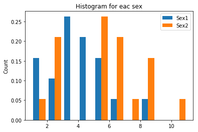

# 포아송분포

1837년, 프랑스의 수학자 포아송S.D. Poisson은 프러시사의 기병군단에서 매년 말발굽에 채여 죽는 병사의 수는 평균(u) 0.61의 일정한 분포를 따른다고 보고하였다. 그의 이름을 따서 포아송 분포(Poisson distribution)라고 명명된 이 분포는 특정 기간 또는 공간상에서 일정한 평균 발생률을 가지고 무작위로 발생하게 되는 희귀사건의 발생 건수에 관한 확률분포이다. 이 확률분포에 근거한 포아송 회구분석 Poisson regression analysis을 사용하면 일정한 기간 동안 어떤 인구집단의 특정 희귀사건의 발생률을 추정하고 예측할 수 있다. 일반적으로 전체 인구집단에서 5% 미만의 발생을 보이는 질병의 경우 포아송 희귀분석을 적용할 수 있으며 이를 통해 연도별 발생률의 변화와 함께 성별, 나이 등의 설명변수들이 질병의 발생률에 미치는 영향  등을 함께 알 수 있다. 로지스틱 회귀분석이 질병의 위험인자에 대한 연구이고, Cox의 비례위험모형이 생존율의 위험인자에 대한 연구라면, 포아송 회구분석은 질병의 발생률과 발생귤에 영향을 미치는 인자에 대한 연구이다. 


```python
import pandas as pd
import numpy as np
import matplotlib.pyplot as plt
```

다음은 1993년부터 2011년까지 한 대학병원에서 관찰한 피부암의 발생에 대한 자료이다. 피부암의 발생률이 성별에 따라 차이가 있는지, 시간이 흐름에 따라 증가하는 경향이 있는지 검정하라.

필드설명
- year : 연도
- sex : 성별 (1=남자, 2=여자)
- case : 발생수
- total : 전체인구
- in_total : LN(total)


```python
df = pd.read_csv('data/12_poisson_regression.csv')
df.head()
```


<div>
<style scoped>
    .dataframe tbody tr th:only-of-type {
        vertical-align: middle;
    }

    .dataframe tbody tr th {
        vertical-align: top;
    }

    .dataframe thead th {
        text-align: right;
    }
</style>
<table border="1" class="dataframe">
  <thead>
    <tr style="text-align: right;">
      <th></th>
      <th>year</th>
      <th>sex</th>
      <th>case</th>
      <th>total</th>
      <th>ln_total</th>
    </tr>
  </thead>
  <tbody>
    <tr>
      <th>0</th>
      <td>1993</td>
      <td>1</td>
      <td>1</td>
      <td>13783</td>
      <td>9.53119</td>
    </tr>
    <tr>
      <th>1</th>
      <td>1993</td>
      <td>2</td>
      <td>1</td>
      <td>13223</td>
      <td>9.48971</td>
    </tr>
    <tr>
      <th>2</th>
      <td>1994</td>
      <td>1</td>
      <td>1</td>
      <td>12666</td>
      <td>9.44668</td>
    </tr>
    <tr>
      <th>3</th>
      <td>1994</td>
      <td>2</td>
      <td>2</td>
      <td>14842</td>
      <td>9.60522</td>
    </tr>
    <tr>
      <th>4</th>
      <td>1995</td>
      <td>1</td>
      <td>1</td>
      <td>13932</td>
      <td>9.54194</td>
    </tr>
  </tbody>
</table>
</div>


```python
df.describe()
```


<div>
<style scoped>
    .dataframe tbody tr th:only-of-type {
        vertical-align: middle;
    }

    .dataframe tbody tr th {
        vertical-align: top;
    }

    .dataframe thead th {
        text-align: right;
    }
</style>
<table border="1" class="dataframe">
  <thead>
    <tr style="text-align: right;">
      <th></th>
      <th>year</th>
      <th>sex</th>
      <th>case</th>
      <th>total</th>
      <th>ln_total</th>
    </tr>
  </thead>
  <tbody>
    <tr>
      <th>count</th>
      <td>38.000000</td>
      <td>38.000000</td>
      <td>38.000000</td>
      <td>38.000000</td>
      <td>38.000000</td>
    </tr>
    <tr>
      <th>mean</th>
      <td>2002.000000</td>
      <td>1.500000</td>
      <td>4.394737</td>
      <td>18275.421053</td>
      <td>9.799471</td>
    </tr>
    <tr>
      <th>std</th>
      <td>5.550749</td>
      <td>0.506712</td>
      <td>2.377137</td>
      <td>3059.204813</td>
      <td>0.169600</td>
    </tr>
    <tr>
      <th>min</th>
      <td>1993.000000</td>
      <td>1.000000</td>
      <td>1.000000</td>
      <td>12666.000000</td>
      <td>9.446680</td>
    </tr>
    <tr>
      <th>25%</th>
      <td>1997.250000</td>
      <td>1.000000</td>
      <td>2.250000</td>
      <td>16509.750000</td>
      <td>9.711700</td>
    </tr>
    <tr>
      <th>50%</th>
      <td>2002.000000</td>
      <td>1.500000</td>
      <td>4.500000</td>
      <td>18079.500000</td>
      <td>9.802530</td>
    </tr>
    <tr>
      <th>75%</th>
      <td>2006.750000</td>
      <td>2.000000</td>
      <td>6.000000</td>
      <td>20067.000000</td>
      <td>9.906823</td>
    </tr>
    <tr>
      <th>max</th>
      <td>2011.000000</td>
      <td>2.000000</td>
      <td>11.000000</td>
      <td>24503.000000</td>
      <td>10.106550</td>
    </tr>
  </tbody>
</table>
</div>


```python
uniqSex = sorted(df['sex'].unique())
mean_sex = []
for elem in uniqSex:
    mean_sex.append(df[df['sex'] == elem]['case'].mean())
    
std_sex = []
for elem in uniqSex:
    std_sex.append(df[df['sex'] == elem]['case'].std())

mean_sex = np.array(mean_sex)
std_sex = np.array(std_sex)
mean_std = pd.DataFrame(mean_sex, columns=['mean'])
mean_std['SD'] = std_sex

print(mean_std)
```

           mean        SD
    0  3.526316  1.806421
    1  5.263158  2.600045


```python
histData = []
for elem in uniqSex:
    histData.append(df[df['sex'] == elem]['case'].values)
    
plt.hist(tuple(histData), bins=10, normed = True, histtype='bar', label=map(lambda x: 'Sex' + str(x), uniqSex))
plt.legend()
plt.ylabel('Count')
plt.title("Histogram for eac sex")
plt.show()
```

    /home/sean/anaconda3/envs/alien/lib/python3.6/site-packages/matplotlib/axes/_axes.py:6521: MatplotlibDeprecationWarning: 
    The 'normed' kwarg was deprecated in Matplotlib 2.1 and will be removed in 3.1. Use 'density' instead.
      alternative="'density'", removal="3.1")


    

    


```python
import statsmodels.api as sm
from statsmodels.formula.api import poisson

ml = poisson('case ~ sex + year', data = df).fit()
ml.summary()
```

    Optimization terminated successfully.
             Current function value: 1.754074
             Iterations 8


<table class="simpletable">
<caption>Poisson Regression Results</caption>
<tr>
  <th>Dep. Variable:</th>         <td>case</td>       <th>  No. Observations:  </th>  <td>    38</td>  
</tr>
<tr>
  <th>Model:</th>                <td>Poisson</td>     <th>  Df Residuals:      </th>  <td>    35</td>  
</tr>
<tr>
  <th>Method:</th>                 <td>MLE</td>       <th>  Df Model:          </th>  <td>     2</td>  
</tr>
<tr>
  <th>Date:</th>            <td>Wed, 07 Aug 2019</td> <th>  Pseudo R-squ.:     </th>  <td>0.2181</td>  
</tr>
<tr>
  <th>Time:</th>                <td>15:52:16</td>     <th>  Log-Likelihood:    </th> <td> -66.655</td> 
</tr>
<tr>
  <th>converged:</th>             <td>True</td>       <th>  LL-Null:           </th> <td> -85.244</td> 
</tr>
<tr>
  <th>Covariance Type:</th>     <td>nonrobust</td>    <th>  LLR p-value:       </th> <td>8.450e-09</td>
</tr>
</table>
<table class="simpletable">
<tr>
      <td></td>         <th>coef</th>     <th>std err</th>      <th>z</th>      <th>P>|z|</th>  <th>[0.025</th>    <th>0.975]</th>  
</tr>
<tr>
  <th>Intercept</th> <td> -160.2323</td> <td>   29.967</td> <td>   -5.347</td> <td> 0.000</td> <td> -218.967</td> <td> -101.497</td>
</tr>
<tr>
  <th>sex</th>       <td>    0.4005</td> <td>    0.158</td> <td>    2.537</td> <td> 0.011</td> <td>    0.091</td> <td>    0.710</td>
</tr>
<tr>
  <th>year</th>      <td>    0.0804</td> <td>    0.015</td> <td>    5.379</td> <td> 0.000</td> <td>    0.051</td> <td>    0.110</td>
</tr>
</table>


```python
from statsmodels.genmod.generalized_estimating_equations import GEE
from statsmodels.genmod.cov_struct import (Exchangeable,
    Independence,Autoregressive)
from statsmodels.genmod.families import Poisson

fam = Poisson()
ind = Independence()
#ex = Exchangeable()
model1 = GEE.from_formula("case ~ sex + year", "case", data = df, cov_struct=ind, family=fam)
result1 = model1.fit()
print(result1.summary())
```

                                   GEE Regression Results                              
    ===================================================================================
    Dep. Variable:                        case   No. Observations:                   38
    Model:                                 GEE   No. clusters:                        9
    Method:                        Generalized   Min. cluster size:                   1
                          Estimating Equations   Max. cluster size:                   8
    Family:                            Poisson   Mean cluster size:                 4.2
    Dependence structure:         Independence   Num. iterations:                     2
    Date:                     Wed, 07 Aug 2019   Scale:                           1.000
    Covariance type:                    robust   Time:                         15:56:29
    ==============================================================================
                     coef    std err          z      P>|z|      [0.025      0.975]
    ------------------------------------------------------------------------------
    Intercept   -160.2323     28.076     -5.707      0.000    -215.261    -105.204
    sex            0.4005      0.067      5.973      0.000       0.269       0.532
    year           0.0804      0.014      5.742      0.000       0.053       0.108
    ==============================================================================
    Skew:                          0.6757   Kurtosis:                      -0.3535
    Centered skew:                 0.1906   Centered kurtosis:             -0.2127
    ==============================================================================

