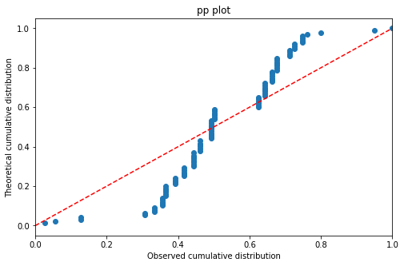

# 목차
1. 단순회귀분석
1. 다중회귀분석
1. 로지스틱 회귀분석

# 단순회귀분석


```python
import pandas as pd
import scipy.stats as stats
import numpy as np
from sklearn.linear_model import LinearRegression
```


```python
df = pd.read_csv("data/6_correlation_and_regression.csv")
df.head()
```


<div>
<style scoped>
    .dataframe tbody tr th:only-of-type {
        vertical-align: middle;
    }

    .dataframe tbody tr th {
        vertical-align: top;
    }

    .dataframe thead th {
        text-align: right;
    }
</style>
<table border="1" class="dataframe">
  <thead>
    <tr style="text-align: right;">
      <th></th>
      <th>age</th>
      <th>height</th>
      <th>weight</th>
      <th>waistline</th>
      <th>BMI</th>
      <th>SBP</th>
    </tr>
  </thead>
  <tbody>
    <tr>
      <th>0</th>
      <td>57</td>
      <td>164.0</td>
      <td>62.0</td>
      <td>85.0</td>
      <td>23.1</td>
      <td>147</td>
    </tr>
    <tr>
      <th>1</th>
      <td>25</td>
      <td>172.0</td>
      <td>54.0</td>
      <td>65.0</td>
      <td>18.3</td>
      <td>116</td>
    </tr>
    <tr>
      <th>2</th>
      <td>57</td>
      <td>157.0</td>
      <td>59.0</td>
      <td>83.0</td>
      <td>23.9</td>
      <td>122</td>
    </tr>
    <tr>
      <th>3</th>
      <td>43</td>
      <td>170.0</td>
      <td>87.8</td>
      <td>104.0</td>
      <td>30.4</td>
      <td>130</td>
    </tr>
    <tr>
      <th>4</th>
      <td>52</td>
      <td>155.0</td>
      <td>50.0</td>
      <td>83.0</td>
      <td>20.8</td>
      <td>120</td>
    </tr>
  </tbody>
</table>
</div>


```python
x = df['waistline'].values.reshape(-1,1)
y = df['BMI'].values
print("x={},y={}".format(x[:5], y[:5]))
```

    x=[[ 85.]
     [ 65.]
     [ 83.]
     [104.]
     [ 83.]],y=[23.1 18.3 23.9 30.4 20.8]


```python
model = LinearRegression()
model.fit(x,y)
```


    LinearRegression(copy_X=True, fit_intercept=True, n_jobs=None, normalize=False)


```python
r_sq = model.score(x,y)
print('coefficient of determination: ', r_sq)
print('intercept: ', model.intercept_)
print('slope: ', model.coef_)
```

    coefficient of determination:  0.6410564843035287
    intercept:  -3.976108553569418
    slope:  [0.33134716]


sklearn으로는 p-value값을 알 수 없다. statsmodels를 사용해 찾아보기로 한다.


```python
import statsmodels.api as sm
```


```python
x2 = sm.add_constant(x)
est = sm.OLS(y, x2)
est2 = est.fit()
print(est2.summary())
```

                                OLS Regression Results                            
    ==============================================================================
    Dep. Variable:                      y   R-squared:                       0.641
    Model:                            OLS   Adj. R-squared:                  0.640
    Method:                 Least Squares   F-statistic:                     571.5
    Date:                Fri, 02 Aug 2019   Prob (F-statistic):           3.54e-73
    Time:                        22:31:08   Log-Likelihood:                -707.76
    No. Observations:                 322   AIC:                             1420.
    Df Residuals:                     320   BIC:                             1427.
    Df Model:                           1                                         
    Covariance Type:            nonrobust                                         
    ==============================================================================
                     coef    std err          t      P>|t|      [0.025      0.975]
    ------------------------------------------------------------------------------
    const         -3.9761      1.255     -3.169      0.002      -6.445      -1.507
    x1             0.3313      0.014     23.906      0.000       0.304       0.359
    ==============================================================================
    Omnibus:                       35.002   Durbin-Watson:                   2.031
    Prob(Omnibus):                  0.000   Jarque-Bera (JB):              111.833
    Skew:                           0.424   Prob(JB):                     5.20e-25
    Kurtosis:                       5.760   Cond. No.                         933.
    ==============================================================================
    
    Warnings:
    [1] Standard Errors assume that the covariance matrix of the errors is correctly specified.


BMI의 변동은 이 회귀식(R-squared)에 의해 64%만큼 설명될 수 있으며 이 회귀식은 통계적으로 유의하다(p < 0.001)  
허리둘레가 1증가하면 BMI는 평균적으로 0.331 (coef)만큼 증가하며 이는 통계적으로 유의하다.(p<0.001)  
추정된 통계식: BMI = -3.9761 + 0.3313 x Waistline

# 다중회귀분석


```python
df1 = df.drop(['SBP'], axis=1)
df1.head()
```


<div>
<style scoped>
    .dataframe tbody tr th:only-of-type {
        vertical-align: middle;
    }

    .dataframe tbody tr th {
        vertical-align: top;
    }

    .dataframe thead th {
        text-align: right;
    }
</style>
<table border="1" class="dataframe">
  <thead>
    <tr style="text-align: right;">
      <th></th>
      <th>age</th>
      <th>height</th>
      <th>weight</th>
      <th>waistline</th>
      <th>BMI</th>
    </tr>
  </thead>
  <tbody>
    <tr>
      <th>0</th>
      <td>57</td>
      <td>164.0</td>
      <td>62.0</td>
      <td>85.0</td>
      <td>23.1</td>
    </tr>
    <tr>
      <th>1</th>
      <td>25</td>
      <td>172.0</td>
      <td>54.0</td>
      <td>65.0</td>
      <td>18.3</td>
    </tr>
    <tr>
      <th>2</th>
      <td>57</td>
      <td>157.0</td>
      <td>59.0</td>
      <td>83.0</td>
      <td>23.9</td>
    </tr>
    <tr>
      <th>3</th>
      <td>43</td>
      <td>170.0</td>
      <td>87.8</td>
      <td>104.0</td>
      <td>30.4</td>
    </tr>
    <tr>
      <th>4</th>
      <td>52</td>
      <td>155.0</td>
      <td>50.0</td>
      <td>83.0</td>
      <td>20.8</td>
    </tr>
  </tbody>
</table>
</div>


```python
x3 = sm.add_constant(df1)
y3 = df['SBP'].values
est3 = sm.OLS(y3, x3)
est4 = est3.fit()
print(est4.summary())
```

                                OLS Regression Results                            
    ==============================================================================
    Dep. Variable:                      y   R-squared:                       0.097
    Model:                            OLS   Adj. R-squared:                  0.082
    Method:                 Least Squares   F-statistic:                     6.768
    Date:                Fri, 02 Aug 2019   Prob (F-statistic):           5.19e-06
    Time:                        22:47:41   Log-Likelihood:                -1385.7
    No. Observations:                 322   AIC:                             2783.
    Df Residuals:                     316   BIC:                             2806.
    Df Model:                           5                                         
    Covariance Type:            nonrobust                                         
    ==============================================================================
                     coef    std err          t      P>|t|      [0.025      0.975]
    ------------------------------------------------------------------------------
    const        -19.3598    141.974     -0.136      0.892    -298.693     259.973
    age            0.1899      0.105      1.808      0.072      -0.017       0.397
    height         0.5913      0.862      0.686      0.493      -1.105       2.287
    weight        -1.0241      1.014     -1.010      0.313      -3.019       0.971
    waistline      0.3231      0.221      1.465      0.144      -0.111       0.757
    BMI            3.2248      2.718      1.187      0.236      -2.122       8.572
    ==============================================================================
    Omnibus:                       25.643   Durbin-Watson:                   1.959
    Prob(Omnibus):                  0.000   Jarque-Bera (JB):               32.565
    Skew:                           0.612   Prob(JB):                     8.48e-08
    Kurtosis:                       3.964   Cond. No.                     2.92e+04
    ==============================================================================
    
    Warnings:
    [1] Standard Errors assume that the covariance matrix of the errors is correctly specified.
    [2] The condition number is large, 2.92e+04. This might indicate that there are
    strong multicollinearity or other numerical problems.


```python
def stepwise_selection(X, y, 
                       initial_list=[], 
                       threshold_in=0.01, 
                       threshold_out = 0.05, 
                       verbose=True):
    """ Perform a forward-backward feature selection 
    based on p-value from statsmodels.api.OLS
    Arguments:
        X - pandas.DataFrame with candidate features
        y - list-like with the target
        initial_list - list of features to start with (column names of X)
        threshold_in - include a feature if its p-value < threshold_in
        threshold_out - exclude a feature if its p-value > threshold_out
        verbose - whether to print the sequence of inclusions and exclusions
    Returns: list of selected features 
    Always set threshold_in < threshold_out to avoid infinite looping.
    See https://en.wikipedia.org/wiki/Stepwise_regression for the details
    """
    included = list(initial_list)
    while True:
        changed=False
        # forward step
        excluded = list(set(X.columns)-set(included))
        new_pval = pd.Series(index=excluded)
        for new_column in excluded:
            model = sm.OLS(y, sm.add_constant(pd.DataFrame(X[included+[new_column]]))).fit()
            new_pval[new_column] = model.pvalues[new_column]
        best_pval = new_pval.min()
        if best_pval < threshold_in:
            best_feature = new_pval.argmin()
            included.append(best_feature)
            changed=True
            if verbose:
                print('Add  {:30} with p-value {:.6}'.format(best_feature, best_pval))

        # backward step
        model = sm.OLS(y, sm.add_constant(pd.DataFrame(X[included]))).fit()
        # use all coefs except intercept
        pvalues = model.pvalues.iloc[1:]
        worst_pval = pvalues.max() # null if pvalues is empty
        if worst_pval > threshold_out:
            changed=True
            worst_feature = pvalues.argmax()
            included.remove(worst_feature)
            if verbose:
                print('Drop {:30} with p-value {:.6}'.format(worst_feature, worst_pval))
        if not changed:
            break
    return included

result = stepwise_selection(x3, y3, threshold_in=0.05, threshold_out = 0.10)

print('resulting features:')
print(result)
```

    Add  const                          with p-value 2.08556e-271
    Add  BMI                            with p-value 0.000144286
    Add  age                            with p-value 0.00025673
    resulting features:
    ['const', 'BMI', 'age']


    /home/scalefreeus/anaconda3/envs/peanuts/lib/python3.7/site-packages/ipykernel_launcher.py:30: FutureWarning: 
    The current behaviour of 'Series.argmin' is deprecated, use 'idxmin'
    instead.
    The behavior of 'argmin' will be corrected to return the positional
    minimum in the future. For now, use 'series.values.argmin' or
    'np.argmin(np.array(values))' to get the position of the minimum
    row.


```python
x_s = df[['BMI','age']]
x_s1 = sm.add_constant(x_s)
est_s = sm.OLS(y3, x_s1)
est_s1 = est_s.fit()
print(est_s1.summary())
```

                                OLS Regression Results                            
    ==============================================================================
    Dep. Variable:                      y   R-squared:                       0.083
    Model:                            OLS   Adj. R-squared:                  0.078
    Method:                 Least Squares   F-statistic:                     14.53
    Date:                Fri, 02 Aug 2019   Prob (F-statistic):           9.16e-07
    Time:                        23:06:01   Log-Likelihood:                -1388.1
    No. Observations:                 322   AIC:                             2782.
    Df Residuals:                     319   BIC:                             2793.
    Df Model:                           2                                         
    Covariance Type:            nonrobust                                         
    ==============================================================================
                     coef    std err          t      P>|t|      [0.025      0.975]
    ------------------------------------------------------------------------------
    const         82.9130      8.663      9.571      0.000      65.869      99.957
    BMI            1.1456      0.278      4.123      0.000       0.599       1.692
    age            0.3153      0.085      3.697      0.000       0.148       0.483
    ==============================================================================
    Omnibus:                       29.551   Durbin-Watson:                   1.953
    Prob(Omnibus):                  0.000   Jarque-Bera (JB):               39.538
    Skew:                           0.659   Prob(JB):                     2.60e-09
    Kurtosis:                       4.100   Cond. No.                         499.
    ==============================================================================
    
    Warnings:
    [1] Standard Errors assume that the covariance matrix of the errors is correctly specified.


단계 선택법(stepwise method)에 의해 회귀모형은 모형1 -> 모형2의 2단계에서 결정되었다. 수축기 혈압은 최종 결정된 모형2의 회귀식에 의해 8.3%만큼(R-squared) 설명될 수 있다.  
단계 선택법에 의해 최종 결정된 모형2는 분산분석에 의해 유의수준 p<0.001로 유의하다.  
모형2에서 BMI와 Age의 회귀계수는 각각 1.1456, 0.3153이며 이둘은 모두 유의수준 p<0.001로 유의하다.  


```python
r = est_s1.predict(x_s1)
r
```


    0      127.348254
    1      111.759576
    2      128.264706
    3      131.296517
    4      123.136898
              ...    
    317    120.383044
    318    128.634485
    319    135.310492
    320    131.361105
    321    136.347123
    Length: 322, dtype: float64


```python
y3
```


    array([147, 116, 122, 130, 120, 128,  97, 145, 110, 170, 180, 127, 140,
           110, 138, 106, 150, 131, 184, 138, 117, 130, 110, 130, 120, 131,
           140,  94, 112, 129, 119, 140, 148, 109, 144, 130, 126, 125, 128,
           126, 146, 128, 130, 130, 130, 144, 107, 150, 110, 132, 130, 100,
           120, 140, 150, 126, 130,  86, 140, 144, 147, 120, 100, 121, 136,
           130, 107, 136, 149, 137, 138, 150, 120, 140, 126, 146, 160, 120,
           124, 100, 140, 100, 110, 116, 116, 127, 116, 110, 112,  91, 120,
           140,  96, 116, 133, 100, 150, 140, 134, 130, 160, 130, 143, 118,
           120, 110, 143, 125, 121, 120, 126, 140, 137, 133, 100, 176, 130,
           158, 114, 124, 128, 140, 136, 120, 120, 138, 121, 100, 120, 120,
           112, 110, 138, 135, 110, 138, 122, 138, 120, 122, 134, 130, 202,
           140, 165, 128, 153, 114, 136, 154, 120, 112, 132, 100, 139, 142,
           125, 143, 116, 110, 110, 140,  95, 126, 129, 124,  98, 130, 120,
           125, 134, 113, 120, 138, 101, 123, 173, 140, 130, 130, 110, 121,
           127, 100, 120, 166, 122, 180, 130, 124, 158, 116, 144, 114, 109,
           103,  92, 180, 127, 110, 110, 124, 120, 134, 120, 140, 120, 120,
           154, 111, 121, 142, 142, 134, 150, 144, 140, 100, 121, 195, 117,
           147, 120, 170, 140, 180, 137, 130, 130, 134, 139, 120, 170, 120,
           134, 120, 120, 100, 120, 135, 118, 180, 144, 122, 150, 160, 124,
           120,  95, 155, 110, 130, 120, 144, 141, 132, 108, 140, 116, 150,
           110, 140, 113, 146, 130, 140, 140, 150, 136, 140, 110, 110, 120,
           120, 133, 140, 140, 120, 160, 115, 150, 140, 117, 132, 150, 142,
           164,  96,  90, 112, 143, 119, 120, 125, 134, 135, 120, 128, 120,
           140, 130, 100, 120, 120, 100, 123, 102, 130, 120, 100,  90, 130,
           128, 131, 116, 110, 100,  97, 130, 131, 130, 162])


```python
import matplotlib.pyplot as plt
fig = plt.figure(figsize=(8,5))
ax2 = fig.add_subplot()

data = y3
norm = r
# Calculate cumulative distributions
bins = np.percentile(norm,range(0,101))
data_counts, bins = np.histogram(data,bins)
norm_counts, bins = np.histogram(norm,bins)
cum_data = np.cumsum(data_counts)
cum_norm = np.cumsum(norm_counts)
cum_data = cum_data / max(cum_data)
cum_norm = cum_norm / max(cum_norm)
    
ax2.plot(cum_data,cum_norm, "o")
min_value = np.floor(min(min(cum_norm),min(cum_data)))
max_value = np.ceil(max(max(cum_norm),max(cum_data)))
ax2.plot([min_value,max_value],[min_value,max_value],'r--')
ax2.set_xlim(min_value,max_value)
ax2.set_xlabel('Observed cumulative distribution')
ax2.set_ylabel('Theoretical cumulative distribution')
title = 'pp plot'
ax2.set_title(title)
```


    Text(0.5, 1.0, 'pp plot')


    

    


# 로지스틱 회귀분석
회귀분석은 근본적으로 연속형 자료를 종속변수로 갖는다. 질환의 유무는 범주형 자료이기 때문에 회귀분석에 그대로 적용할 수가 없다. 그러나 회귀분석을 확정하여 종속변수 y를 f(x)라는 함수로 치환한 일반화 선형모형(generalized linear model)을 이용하면, 보다 폭넓은 현상들을 회귀모형으로 설명하는 것이 가능해진다. 로지스틱 회귀분석은 이 일반화 선형모형의 한 형태이다. 지로한이 있을 확률을 $ p $ 라고 할 때, 로지스틱 회귀분석에서는 $ f(x) = ln \tfrac{p}{1-p} $ 라는 함수를 일반화 선형모형에 대입하여 적용한다. 

일반선형모형

\begin{equation}
y = \alpha + \beta_{1}\times x_{1} + \beta_{2}\times x_{2}+ \cdots + \beta_{k}\times x_{k}
\end{equation}

일반화 선형모형

\begin{equation}
f(y) = \alpha + \beta_{1}\times x_{1} + \beta_{2}\times x_{2}+ \cdots + \beta_{k}\times x_{k}
\end{equation}

로지스틱 회귀분석

\begin{equation}
ln \tfrac{p}{1-p} = \alpha + \beta_{1}\times x_{1} + \beta_{2}\times x_{2}+ \cdots + \beta_{k}\times x_{k}
\end{equation}
