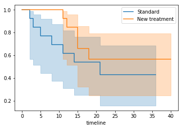
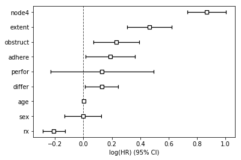
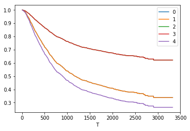
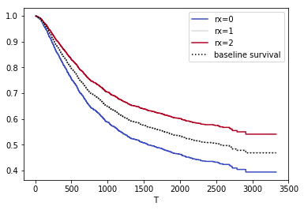

# 생존율의 추정 및 두 군의 생존율 비교
1. Kaplan-Meier 생존분석
1. 로그순위법
1. 생존율에 영향을 미치는 위험인자
  1. Cox의 비례위험모형

어떤 암의 생존율을 파악하거나 두 가지 치료법의 예후를 비교하는 것은 임의의 한 시점의 환자 상태를 조사하는 것만으로는 부족할 수 있다. 두 치료법의 5년 혹은 10년 생존율이 같다고 해서 두 가지 치료가 똑같은 의미를 갖는 것은 아닐 수 있기 때문이다. 예를 들어, 아무런 치료를 받지 않았을 때 6개월 내에 80%의 사망률을 보이는 암이 항암치료를 통해 2년 생존율을 50%까지 올릴 수 있다면 설령 5년 뒤의 생존율이 같더라도 항암치료는 임상적으로 의미를 가지기에 충분하다. 이렇듯 시간에 따른 사망이나 재발 등의 변화를 관찰하는 분석을 생존분석(survival analysis)이라 하며, 생존분석에서 '사망'이나 '재발'과 같이 연구자가 관심을 갖고 있는 변화를 사건(event)이라고 한다. 생존분석에서 분석의 대상은 사건 발생까지의 시간(time to event)이다. 의학 및 보건 연구에서 흔히 시행되는 생존분석으로는 특정 집단의 생존율을 추정하는 Kaplan-Meier 생존분석(Kaplan-Meier curve Analysis)와, 두 집단의 생존율을 비교하는 로그 순위법(Log-rank test), 그리고 생존율에 영향을 미치는 위험인자를 분석하는 Cox의 비례위험모형(Cox's proportional regression analysis)등이 있다. 

Python에서 생존율 분석을 위해서는 lifelines 라이브러리가 필요하다. conda를 사용해서 아래와 같이 미리 설치하면 된다. 


```!conda install -c conda-forge lifelines```


```python
from lifelines import KaplanMeierFitter
import pandas as pd
import numpy as np
import scipy.stats as stats

df = pd.read_csv("data/7_ovrian_cancer_survival_data.csv")
df.head()
```


<div>
<style scoped>
    .dataframe tbody tr th:only-of-type {
        vertical-align: middle;
    }

    .dataframe tbody tr th {
        vertical-align: top;
    }

    .dataframe thead th {
        text-align: right;
    }
</style>
<table border="1" class="dataframe">
  <thead>
    <tr style="text-align: right;">
      <th></th>
      <th>id</th>
      <th>treatment</th>
      <th>month</th>
      <th>death</th>
      <th>age</th>
      <th>residual</th>
      <th>condition</th>
      <th>time</th>
    </tr>
  </thead>
  <tbody>
    <tr>
      <th>0</th>
      <td>1</td>
      <td>1</td>
      <td>2</td>
      <td>1</td>
      <td>72</td>
      <td>2</td>
      <td>1</td>
      <td>59</td>
    </tr>
    <tr>
      <th>1</th>
      <td>2</td>
      <td>1</td>
      <td>3</td>
      <td>1</td>
      <td>74</td>
      <td>2</td>
      <td>1</td>
      <td>115</td>
    </tr>
    <tr>
      <th>2</th>
      <td>3</td>
      <td>1</td>
      <td>5</td>
      <td>1</td>
      <td>66</td>
      <td>2</td>
      <td>2</td>
      <td>156</td>
    </tr>
    <tr>
      <th>3</th>
      <td>4</td>
      <td>2</td>
      <td>14</td>
      <td>0</td>
      <td>53</td>
      <td>2</td>
      <td>1</td>
      <td>421</td>
    </tr>
    <tr>
      <th>4</th>
      <td>5</td>
      <td>1</td>
      <td>14</td>
      <td>1</td>
      <td>50</td>
      <td>2</td>
      <td>1</td>
      <td>431</td>
    </tr>
  </tbody>
</table>
</div>


```python
groups = df['treatment']
i1 = (groups == 1) ## group i1, having the pandas series for the 1st cohort
i2 = (groups == 2) ## group i2, having the pandas series for the 2st cohort

T = df['month']
E = df['death']
```

# Kaplan-Meier 생존분석


```python
import matplotlib as plt

kmf1 = KaplanMeierFitter() ## instantiate the class to create an object

## fit the model for 1st cohort
kmf1.fit(T[i1], E[i1], label='Standard')
print(kmf1.event_table)
print('\n 시간에 누적 생존 비율')
print(1- kmf1.cumulative_density_)
a1 = kmf1.plot()

## fit the model for 2nd cohort
kmf1.fit(T[i2], E[i2], label='New treatment')
print(kmf1.event_table)
print('\n 시간에 누적 생존 비율')
print(1- kmf1.cumulative_density_)
kmf1.plot(ax=a1)
```

              removed  observed  censored  entrance  at_risk
    event_at                                                
    0.0             0         0         0        13       13
    2.0             1         1         0         0       13
    3.0             1         1         0         0       12
    5.0             1         1         0         0       11
    8.0             1         1         0         0       10
    11.0            1         1         0         0        9
    14.0            2         1         1         0        8
    15.0            1         0         1         0        6
    21.0            1         1         0         0        5
    26.0            1         0         1         0        4
    28.0            1         0         1         0        3
    34.0            1         0         1         0        2
    36.0            1         0         1         0        1
    
     시간에 누적 생존 비율
              Standard
    timeline          
    0.0       1.000000
    2.0       0.923077
    3.0       0.846154
    5.0       0.769231
    8.0       0.692308
    11.0      0.615385
    14.0      0.538462
    15.0      0.538462
    21.0      0.430769
    26.0      0.430769
    28.0      0.430769
    34.0      0.430769
    36.0      0.430769
              removed  observed  censored  entrance  at_risk
    event_at                                                
    0.0             0         0         0        13       13
    11.0            1         1         0         0       13
    12.0            2         1         1         0       12
    14.0            1         0         1         0       10
    15.0            2         2         0         0        9
    18.0            1         1         0         0        7
    24.0            1         0         1         0        6
    25.0            2         0         2         0        5
    37.0            1         0         1         0        3
    40.0            2         0         2         0        2
    
     시간에 누적 생존 비율
              New treatment
    timeline               
    0.0            1.000000
    11.0           0.923077
    12.0           0.846154
    14.0           0.846154
    15.0           0.658120
    18.0           0.564103
    24.0           0.564103
    25.0           0.564103
    37.0           0.564103
    40.0           0.564103


    <matplotlib.axes._subplots.AxesSubplot at 0x7f34974467f0>


    

    


표준 치료법의 2년 생존융은 43.1%, 새 치료법의 2년 생존율은 56.4%이다. 

# 로그순위법(Log-rank test)


```python
from lifelines.statistics import logrank_test

results = logrank_test(T[i1], T[i2], event_observed_A=E[i1], event_observed_B=E[i2])
results.print_summary()
```

    <lifelines.StatisticalResult>
                   t_0 = -1
     null_distribution = chi squared
    degrees_of_freedom = 1
    
    ---
     test_statistic    p  -log2(p)
               1.12 0.29      1.78


H<sub>0</sub> : 두 군의 생존곡선은 같다.  
H<sub>1</sub> : 두 군의 생존곡선은 다르다.  
p=0.29 > 0.05 이므로 H<sub>0</sub> 채택  
--> 두 군의 생존곡선은 다르다고 말할 수 없다. 

# Cox의 비례위험모형


```python
df = pd.read_csv('data/11_colon_cancer_survival_data.csv')
df.head()
```


<div>
<style scoped>
    .dataframe tbody tr th:only-of-type {
        vertical-align: middle;
    }

    .dataframe tbody tr th {
        vertical-align: top;
    }

    .dataframe thead th {
        text-align: right;
    }
</style>
<table border="1" class="dataframe">
  <thead>
    <tr style="text-align: right;">
      <th></th>
      <th>id</th>
      <th>time</th>
      <th>status</th>
      <th>rx</th>
      <th>sex</th>
      <th>age</th>
      <th>obstruct</th>
      <th>perfor</th>
      <th>adhere</th>
      <th>differ</th>
      <th>extent</th>
      <th>node4</th>
      <th>nodes</th>
    </tr>
  </thead>
  <tbody>
    <tr>
      <th>0</th>
      <td>1</td>
      <td>1521</td>
      <td>1</td>
      <td>3</td>
      <td>1</td>
      <td>43</td>
      <td>0</td>
      <td>0</td>
      <td>0</td>
      <td>2.0</td>
      <td>3</td>
      <td>1</td>
      <td>5.0</td>
    </tr>
    <tr>
      <th>1</th>
      <td>2</td>
      <td>968</td>
      <td>1</td>
      <td>3</td>
      <td>1</td>
      <td>43</td>
      <td>0</td>
      <td>0</td>
      <td>0</td>
      <td>2.0</td>
      <td>3</td>
      <td>1</td>
      <td>5.0</td>
    </tr>
    <tr>
      <th>2</th>
      <td>3</td>
      <td>3087</td>
      <td>0</td>
      <td>3</td>
      <td>1</td>
      <td>63</td>
      <td>0</td>
      <td>0</td>
      <td>0</td>
      <td>2.0</td>
      <td>3</td>
      <td>0</td>
      <td>1.0</td>
    </tr>
    <tr>
      <th>3</th>
      <td>4</td>
      <td>3087</td>
      <td>0</td>
      <td>3</td>
      <td>1</td>
      <td>63</td>
      <td>0</td>
      <td>0</td>
      <td>0</td>
      <td>2.0</td>
      <td>3</td>
      <td>0</td>
      <td>1.0</td>
    </tr>
    <tr>
      <th>4</th>
      <td>5</td>
      <td>963</td>
      <td>1</td>
      <td>1</td>
      <td>0</td>
      <td>71</td>
      <td>0</td>
      <td>0</td>
      <td>1</td>
      <td>2.0</td>
      <td>2</td>
      <td>1</td>
      <td>7.0</td>
    </tr>
  </tbody>
</table>
</div>


필드설명
- id: 환자번호
- time: 관찰기간(일)
- status: 상태 (0=절단, 1=사망)
- rx : 치료방법 (1=관찰, 2=Levamisole, 3=Levamisole + 5 - FU
- sex : 성별 (0=여, 1=남)
- age : 연령
- obstruct : 장폐색 (0=무, 1=유)
- perfor : 장천공 (0=무, 1=유)
- adhere : 유착 (0=무, 1=유)
- differ : 세포 분화도 (1=well, 2=moderate, 3=poor)
- extent : 침윤 정도 (1=submucosa, 2=muscle, 3=serosa, 4=contiguous structures)
- node4 : 림프절 >= 4개 (0=무, 1=유)


```python
df.drop(['id', 'nodes'], axis=1, inplace=True)
```


```python
df.head()
```


<div>
<style scoped>
    .dataframe tbody tr th:only-of-type {
        vertical-align: middle;
    }

    .dataframe tbody tr th {
        vertical-align: top;
    }

    .dataframe thead th {
        text-align: right;
    }
</style>
<table border="1" class="dataframe">
  <thead>
    <tr style="text-align: right;">
      <th></th>
      <th>time</th>
      <th>status</th>
      <th>rx</th>
      <th>sex</th>
      <th>age</th>
      <th>obstruct</th>
      <th>perfor</th>
      <th>adhere</th>
      <th>differ</th>
      <th>extent</th>
      <th>node4</th>
    </tr>
  </thead>
  <tbody>
    <tr>
      <th>0</th>
      <td>1521</td>
      <td>1</td>
      <td>3</td>
      <td>1</td>
      <td>43</td>
      <td>0</td>
      <td>0</td>
      <td>0</td>
      <td>2.0</td>
      <td>3</td>
      <td>1</td>
    </tr>
    <tr>
      <th>1</th>
      <td>968</td>
      <td>1</td>
      <td>3</td>
      <td>1</td>
      <td>43</td>
      <td>0</td>
      <td>0</td>
      <td>0</td>
      <td>2.0</td>
      <td>3</td>
      <td>1</td>
    </tr>
    <tr>
      <th>2</th>
      <td>3087</td>
      <td>0</td>
      <td>3</td>
      <td>1</td>
      <td>63</td>
      <td>0</td>
      <td>0</td>
      <td>0</td>
      <td>2.0</td>
      <td>3</td>
      <td>0</td>
    </tr>
    <tr>
      <th>3</th>
      <td>3087</td>
      <td>0</td>
      <td>3</td>
      <td>1</td>
      <td>63</td>
      <td>0</td>
      <td>0</td>
      <td>0</td>
      <td>2.0</td>
      <td>3</td>
      <td>0</td>
    </tr>
    <tr>
      <th>4</th>
      <td>963</td>
      <td>1</td>
      <td>1</td>
      <td>0</td>
      <td>71</td>
      <td>0</td>
      <td>0</td>
      <td>1</td>
      <td>2.0</td>
      <td>2</td>
      <td>1</td>
    </tr>
  </tbody>
</table>
</div>


```python
df.drop(['time', 'age'], axis=1).apply(pd.value_counts)
```


<div>
<style scoped>
    .dataframe tbody tr th:only-of-type {
        vertical-align: middle;
    }

    .dataframe tbody tr th {
        vertical-align: top;
    }

    .dataframe thead th {
        text-align: right;
    }
</style>
<table border="1" class="dataframe">
  <thead>
    <tr style="text-align: right;">
      <th></th>
      <th>status</th>
      <th>rx</th>
      <th>sex</th>
      <th>obstruct</th>
      <th>perfor</th>
      <th>adhere</th>
      <th>differ</th>
      <th>extent</th>
      <th>node4</th>
    </tr>
  </thead>
  <tbody>
    <tr>
      <th>0</th>
      <td>938.0</td>
      <td>NaN</td>
      <td>890.0</td>
      <td>1498.0</td>
      <td>1804.0</td>
      <td>1588.0</td>
      <td>NaN</td>
      <td>NaN</td>
      <td>1348.0</td>
    </tr>
    <tr>
      <th>1</th>
      <td>920.0</td>
      <td>630.0</td>
      <td>968.0</td>
      <td>360.0</td>
      <td>54.0</td>
      <td>270.0</td>
      <td>186.0</td>
      <td>42.0</td>
      <td>510.0</td>
    </tr>
    <tr>
      <th>2</th>
      <td>NaN</td>
      <td>620.0</td>
      <td>NaN</td>
      <td>NaN</td>
      <td>NaN</td>
      <td>NaN</td>
      <td>1326.0</td>
      <td>212.0</td>
      <td>NaN</td>
    </tr>
    <tr>
      <th>3</th>
      <td>NaN</td>
      <td>608.0</td>
      <td>NaN</td>
      <td>NaN</td>
      <td>NaN</td>
      <td>NaN</td>
      <td>300.0</td>
      <td>1518.0</td>
      <td>NaN</td>
    </tr>
    <tr>
      <th>4</th>
      <td>NaN</td>
      <td>NaN</td>
      <td>NaN</td>
      <td>NaN</td>
      <td>NaN</td>
      <td>NaN</td>
      <td>NaN</td>
      <td>86.0</td>
      <td>NaN</td>
    </tr>
  </tbody>
</table>
</div>


```python
df = df.fillna(0)
```


```python
from lifelines import CoxPHFitter

# Using Cox Proportional hazards model
cph = CoxPHFitter()  ## Instantiate the class to create a cph object

cph.fit(df, 'time', event_col='status') ## Fit the data to train the model

cph.print_summary()  ## have a look at the significance of the features
```

    <lifelines.CoxPHFitter: fitted with 1858 observations, 938 censored>
          duration col = 'time'
             event col = 'status'
    number of subjects = 1858
      number of events = 920
        log-likelihood = -6478.42
      time fit was run = 2019-08-07 00:55:48 UTC
    
    ---
              coef exp(coef)  se(coef)     z      p  -log2(p)  lower 0.95  upper 0.95
    rx       -0.21      0.81      0.04 -5.15 <0.005     21.88       -0.29       -0.13
    sex      -0.00      1.00      0.07 -0.05   0.96      0.06       -0.13        0.13
    age       0.00      1.00      0.00  0.78   0.43      1.20       -0.00        0.01
    obstruct  0.23      1.26      0.08  2.81   0.01      7.64        0.07        0.39
    perfor    0.13      1.14      0.18  0.71   0.48      1.07       -0.23        0.49
    adhere    0.19      1.21      0.09  2.11   0.03      4.85        0.01        0.36
    differ    0.13      1.14      0.06  2.14   0.03      4.94        0.01        0.25
    extent    0.47      1.59      0.08  5.83 <0.005     27.45        0.31        0.62
    node4     0.87      2.38      0.07 12.54 <0.005    117.35        0.73        1.00
    ---
    Concordance = 0.66
    Log-likelihood ratio test = 255.04 on 9 df, -log2(p)=162.99


```python
cph.plot()
```


    <matplotlib.axes._subplots.AxesSubplot at 0x7f34869a9b38>


    

    


```python
cph.predict_survival_function(df[:5]).plot()
```


    <matplotlib.axes._subplots.AxesSubplot at 0x7f3486936eb8>


    

    


```python
cph.plot_covariate_groups('rx', [0,1,2], cmap='coolwarm')
```


    <matplotlib.axes._subplots.AxesSubplot at 0x7f3486394e48>


    

    


```python
df['rx'] = df['rx'].astype('category')
df.dtypes
```


    time           int64
    status         int64
    rx          category
    sex            int64
    age            int64
    obstruct       int64
    perfor         int64
    adhere         int64
    differ       float64
    extent         int64
    node4          int64
    dtype: object


```python
df['rx'] = df['rx'].cat.codes
df.head()
```


<div>
<style scoped>
    .dataframe tbody tr th:only-of-type {
        vertical-align: middle;
    }

    .dataframe tbody tr th {
        vertical-align: top;
    }

    .dataframe thead th {
        text-align: right;
    }
</style>
<table border="1" class="dataframe">
  <thead>
    <tr style="text-align: right;">
      <th></th>
      <th>time</th>
      <th>status</th>
      <th>rx</th>
      <th>sex</th>
      <th>age</th>
      <th>obstruct</th>
      <th>perfor</th>
      <th>adhere</th>
      <th>differ</th>
      <th>extent</th>
      <th>node4</th>
      <th>rx_cat</th>
    </tr>
  </thead>
  <tbody>
    <tr>
      <th>0</th>
      <td>1521</td>
      <td>1</td>
      <td>2</td>
      <td>1</td>
      <td>43</td>
      <td>0</td>
      <td>0</td>
      <td>0</td>
      <td>2.0</td>
      <td>3</td>
      <td>1</td>
      <td>2</td>
    </tr>
    <tr>
      <th>1</th>
      <td>968</td>
      <td>1</td>
      <td>2</td>
      <td>1</td>
      <td>43</td>
      <td>0</td>
      <td>0</td>
      <td>0</td>
      <td>2.0</td>
      <td>3</td>
      <td>1</td>
      <td>2</td>
    </tr>
    <tr>
      <th>2</th>
      <td>3087</td>
      <td>0</td>
      <td>2</td>
      <td>1</td>
      <td>63</td>
      <td>0</td>
      <td>0</td>
      <td>0</td>
      <td>2.0</td>
      <td>3</td>
      <td>0</td>
      <td>2</td>
    </tr>
    <tr>
      <th>3</th>
      <td>3087</td>
      <td>0</td>
      <td>2</td>
      <td>1</td>
      <td>63</td>
      <td>0</td>
      <td>0</td>
      <td>0</td>
      <td>2.0</td>
      <td>3</td>
      <td>0</td>
      <td>2</td>
    </tr>
    <tr>
      <th>4</th>
      <td>963</td>
      <td>1</td>
      <td>0</td>
      <td>0</td>
      <td>71</td>
      <td>0</td>
      <td>0</td>
      <td>1</td>
      <td>2.0</td>
      <td>2</td>
      <td>1</td>
      <td>0</td>
    </tr>
  </tbody>
</table>
</div>


